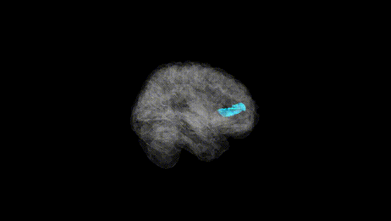
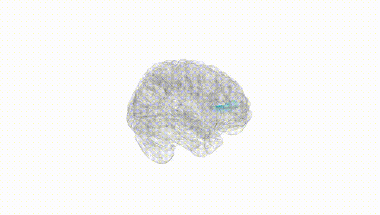
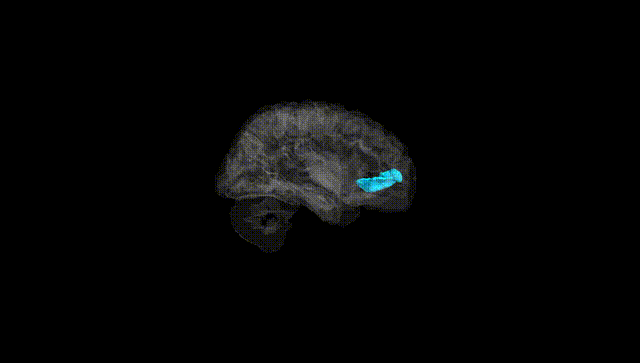
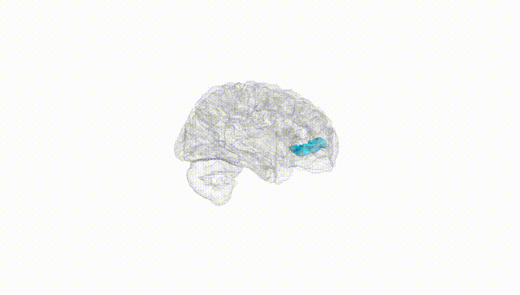
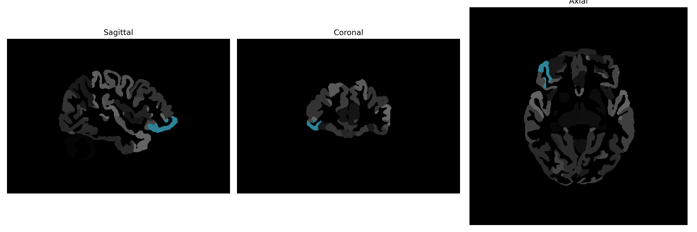

# lateral-orbital-gyrus

## Overview

The Right Lateral Orbital Gyrus is a brain region located in the frontal lobe, specifically within the orbital part of the inferior frontal gyrus. This area is associated with various aspects of cognitive and emotional processing, including decision-making, reward evaluation, and social behavior. It is part of the prefrontal cortex, which is critical for executive function and the regulation of emotional responses. The lateral orbital gyrus interacts with multiple brain circuits, contributing to the integration of sensory information and the modulation of both rational thought and impulse control.

There is no direct Wikipedia link to the Right Lateral Orbital Gyrus. A related area within the structure it is part of can be explored at: [https://en.wikipedia.org/wiki/Inferior_frontal_gyrus](https://en.wikipedia.org/wiki/Inferior_frontal_gyrus)

*Overview generated by GPT-4o (2026).*

---

**Region ID:** 54  
**Hemisphere:** Right  
**Atlas:** brainCOLOR 

---

## Full Brain – Black Background

**Full Quality Version:** [Download MP4](full_black.mp4)

---

## Full Brain – White Background

**Full Quality Version:** [Download MP4](full_white.mp4)

---

## Hemisphere Only – Black Background

**Full Quality Version:** [Download MP4](hemi_black.mp4)

---

## Hemisphere Only – White Background

**Full Quality Version:** [Download MP4](hemi_white.mp4)

---

## Triplanar View (Centered on ROI)

