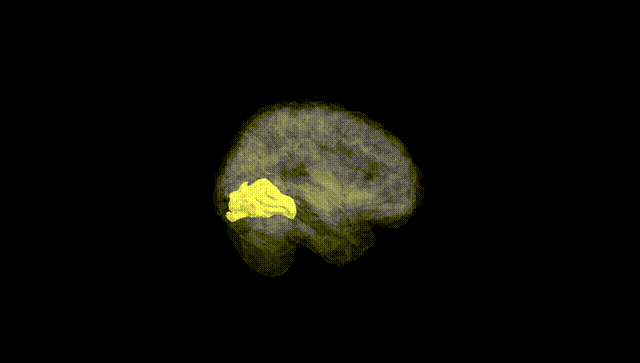
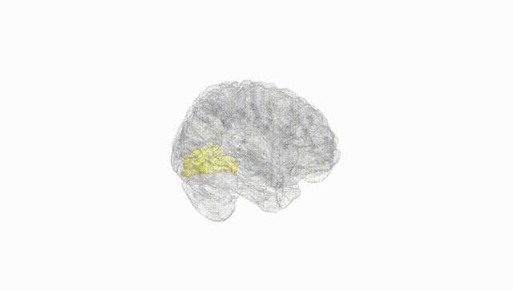
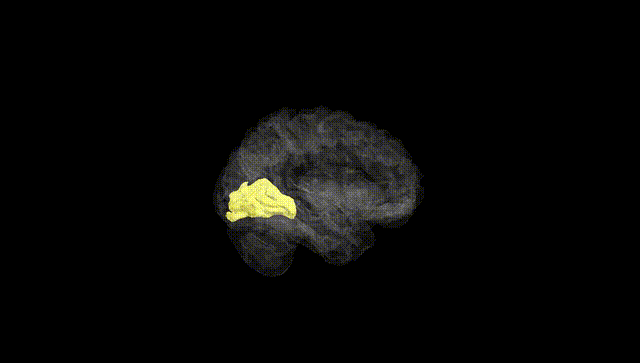
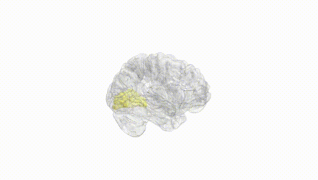
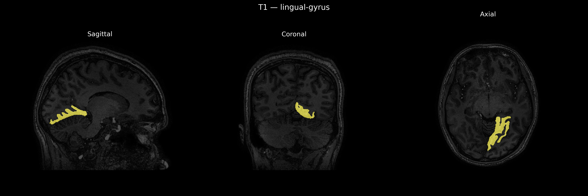
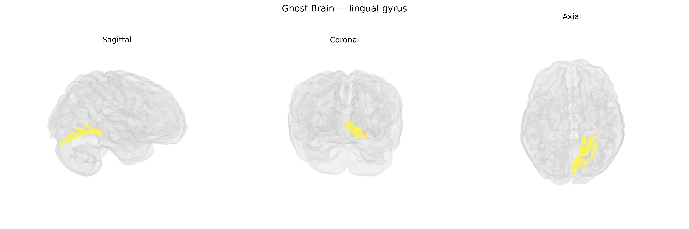

# lingual-gyrus

## Overview

The left lingual gyrus is a ventromedial occipital lobe structure located on the inferior surface of the cerebral hemisphere, extending from the calcarine sulcus posteriorly toward the parahippocampal region anteriorly. It is bounded superiorly by the calcarine sulcus and inferiorly by the collateral sulcus, and consists primarily of visual association cortex involved in processing complex visual stimuli, including color, form, and aspects of visual word and letter recognition. Functionally, the left lingual gyrus is often implicated in reading, visual memory, and higher-order visual processing, and shows strong connectivity with primary visual cortex (V1), other occipital association areas, and medial temporal lobe structures. The brainCOLOR Atlas uses this region as a standardized parcellation unit within the occipital lobe, facilitating quantitative neuroimaging analyses of structure–function relationships. There is no direct Wikipedia entry for the “left lingual gyrus” as a separate page; a closely related and encompassing article is: https://en.wikipedia.org/wiki/Lingual_gyrus.

*Overview generated by GPT-4o (2026).*

---

**Region ID:** 53  
**Hemisphere:** Left  
**Atlas:** brainCOLOR 

---

## Full Brain – Black Background

**Full Quality Version:** [Download MP4](full_black.mp4)

---

## Full Brain – White Background

**Full Quality Version:** [Download MP4](full_white.mp4)

---

## Hemisphere Only – Black Background

**Full Quality Version:** [Download MP4](hemi_black.mp4)

---

## Hemisphere Only – White Background

**Full Quality Version:** [Download MP4](hemi_white.mp4)

---

## Triplanar View – T1 Background

---

## Triplanar View – Ghost Brain


