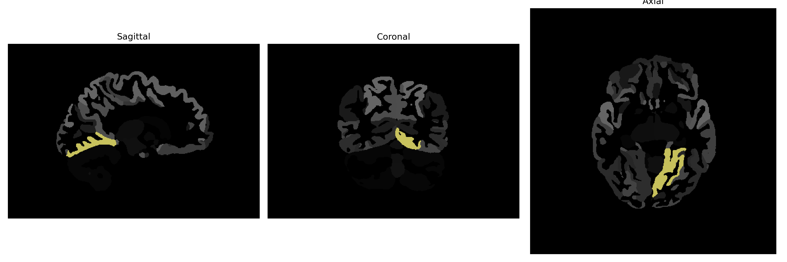

# lingual-gyrus

## Overview

The Left Lingual Gyrus is a brain region located in the occipital lobe, adjacent to the calcarine sulcus. It is part of the visual processing system and is associated with tasks related to vision, including the recognition of letters and complex scenes, as well as processing color and visual memories. Functionally, this region is implicated in integrating visual stimuli and transmitting visual information to higher-order processing areas. The lingual gyrus is anatomically characterized by its involvement in the ventromedial surface of the occipital cortex, and it is linked to both linguistic and non-linguistic visual perception.

There is no direct Wikipedia link for the Left Lingual Gyrus as specifically described in the brainCOLOR Atlas. However, a related page is available at: https://en.wikipedia.org/wiki/Lingual_gyrus.

*Overview generated by GPT-4o (2026).*

---

**Region ID:** 53  
**Hemisphere:** Left  
**Atlas:** brainCOLOR 

---

## Full Brain – Black Background

**Full Quality Version:** [Download MP4](full_black.mp4)

---

## Full Brain – White Background

**Full Quality Version:** [Download MP4](full_white.mp4)

---

## Hemisphere Only – Black Background

**Full Quality Version:** [Download MP4](hemi_black.mp4)

---

## Hemisphere Only – White Background

**Full Quality Version:** [Download MP4](hemi_white.mp4)

---

## Triplanar View (Centered on ROI)

