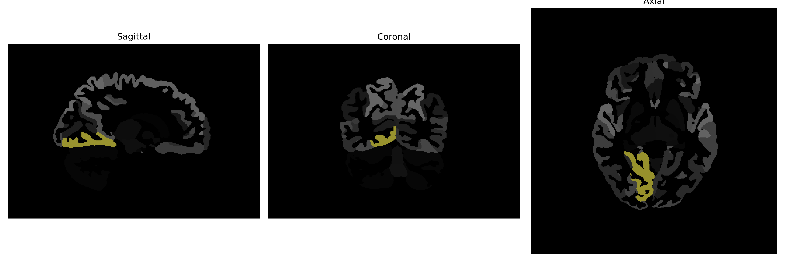

# lingual-gyrus

## Overview

The right lingual gyrus is a brain structure located in the occipital lobe, primarily involved in visual processing and language comprehension. It is named for its shape, which resembles a human tongue (lingual means tongue in Latin). Functionally, the right lingual gyrus has been associated with processing complex visual stimuli, including colors, and contributes to the analysis of visual patterns and reading. Additionally, this region has connections to the brain's language network, implicated in semantic processing. The right lingual gyrus typically displays activation during tasks involving visual memory and recognition, aligning with its key role in the integration of visual information. 

There is no direct Wikipedia link specifically for the right lingual gyrus; however, more information can be found under the general description of the occipital lobe, where it is located: https://en.wikipedia.org/wiki/Occipital_lobe.

*Overview generated by GPT-4o (2026).*

---

**Region ID:** 52  
**Hemisphere:** Right  
**Atlas:** brainCOLOR 

---

## Full Brain – Black Background

**Full Quality Version:** [Download MP4](full_black.mp4)

---

## Full Brain – White Background

**Full Quality Version:** [Download MP4](full_white.mp4)

---

## Hemisphere Only – Black Background

**Full Quality Version:** [Download MP4](hemi_black.mp4)

---

## Hemisphere Only – White Background

**Full Quality Version:** [Download MP4](hemi_white.mp4)

---

## Triplanar View (Centered on ROI)

