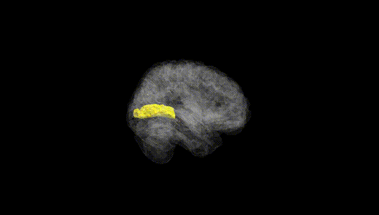
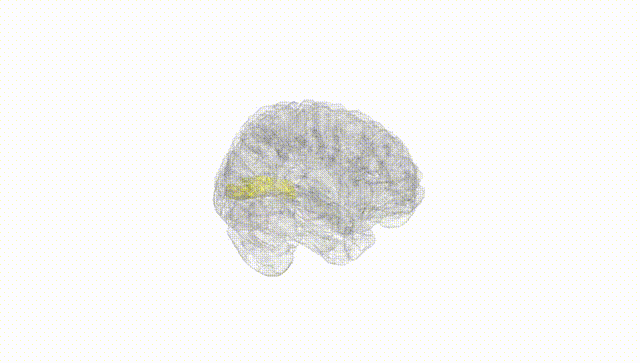
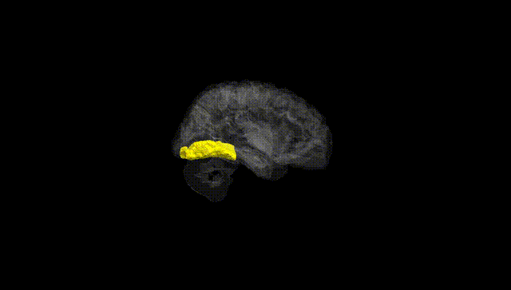
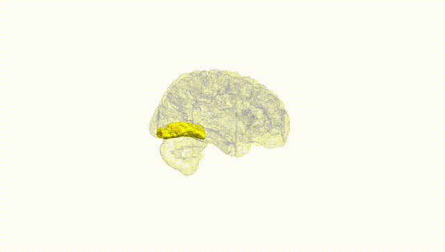
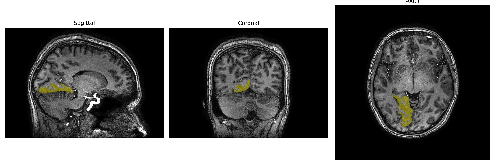
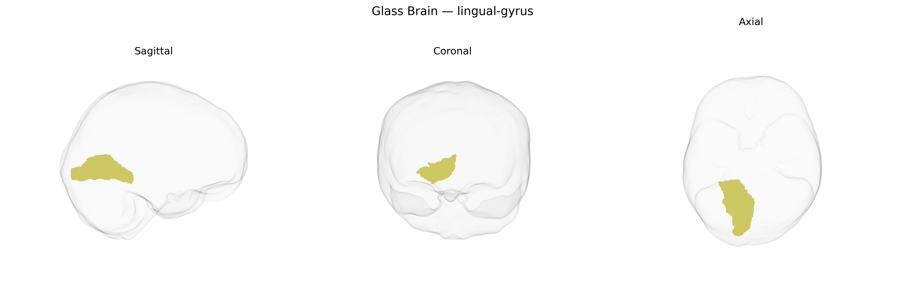

# lingual-gyrus

## Overview

The right lingual gyrus is a cortical region of the occipital lobe located on the medial and inferior surface of the hemisphere, extending from the posterior portion of the calcarine sulcus anteriorly toward the parahippocampal region. It is primarily associated with visual processing, including analysis of complex visual patterns, letter and word form recognition, and aspects of visual memory. Functionally, it contributes to early and intermediate stages of visual information processing and is implicated in reading, visual imagery, and the integration of visual stimuli with higher-order cognitive functions. In the brainCOLOR Atlas, the right lingual gyrus is parcellated as a distinct unilateral region, reflecting its anatomical boundaries and lateralized functional contributions within the right occipital–temporal network. There is no direct Wikipedia page specifically for the “right lingual gyrus”; a closely related and encompassing structure is described here: https://en.wikipedia.org/wiki/Lingual_gyrus

*Overview generated by GPT-4o (2026).*

---

**Region ID:** 52  
**Hemisphere:** Right  
**Atlas:** brainCOLOR 

---

## lingual-gyrus – Black Background (Full Brain)

**Full Quality Version:** [Download MP4](full_black.mp4)

---

## lingual-gyrus – White Background (Full Brain)

**Full Quality Version:** [Download MP4](full_white.mp4)

---

## lingual-gyrus – Black Background (Hemisphere)

**Full Quality Version:** [Download MP4](hemi_black.mp4)

---

## lingual-gyrus – White Background (Hemisphere)

**Full Quality Version:** [Download MP4](hemi_white.mp4)

---

## Triplanar View – T1 Background

---

## Triplanar View – Ghost Brain


