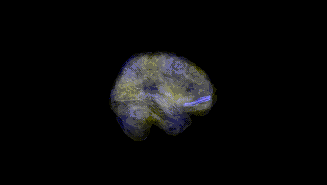
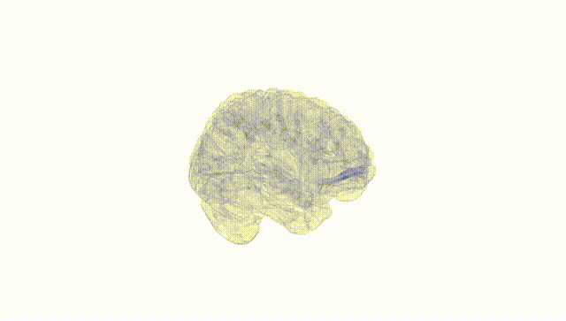
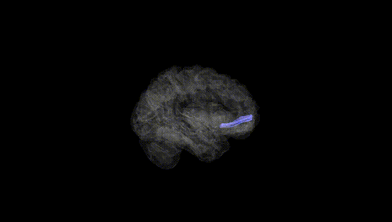
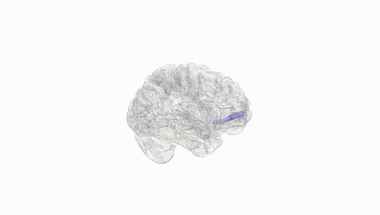
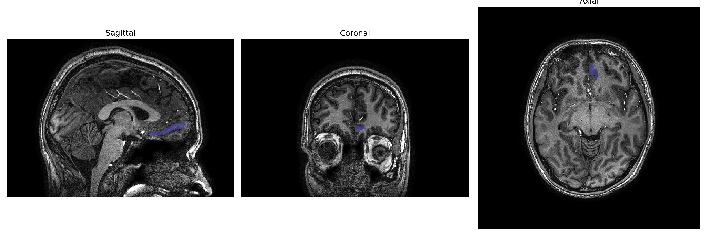
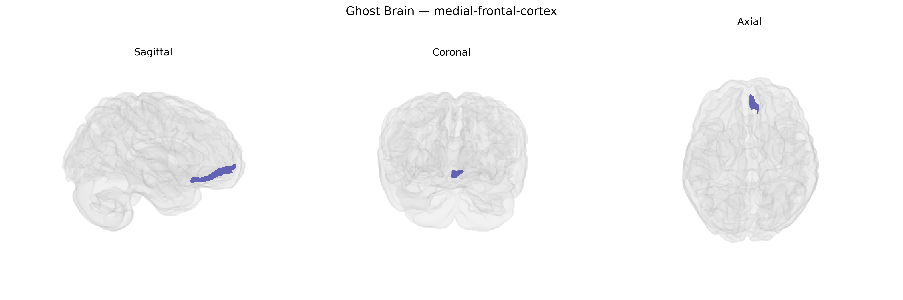

# medial-frontal-cortex
 
## Overview
 
The Left medial-frontal-cortex, as defined in the brainCOLOR Atlas, encompasses medial portions of the frontal lobe on the left hemisphere, including areas involved in higher-order cognitive control, action monitoring, motivation, and aspects of decision-making and social cognition. Functionally, this region overlaps with parts of the medial prefrontal cortex and anterior cingulate territories that integrate internal states, goals, and contextual information to guide behavior, error detection, and performance adjustment. It receives convergent input from limbic, sensory, and associative cortical areas and projects to premotor and subcortical structures, supporting the regulation of voluntary actions and adaptive behavioral strategies. There is no direct Wikipedia article for this exact atlas label; see the related region [Medial prefrontal cortex](https://en.wikipedia.org/wiki/Medial_prefrontal_cortex).
 
The left medial frontal cortex, as defined in the brainCOLOR Atlas, has been implicated in several genetic association studies, including GWAS of cortical thickness and surface area that highlight common variants near genes such as MIR137, TCF4, and CACNA1C, which are also prominent risk loci for schizophrenia and other psychotic disorders. Large consortia like ENIGMA and UK Biobank–based analyses have reported heritable variation in this region’s morphology, with polygenic scores for schizophrenia, major depressive disorder, bipolar disorder, and attention-deficit/hyperactivity disorder predicting structural or functional alterations in medial frontal territories encompassing or overlapping the left medial frontal cortex. In addition, genetic variants associated with cognitive traits (e.g., educational attainment and general cognitive ability) and personality dimensions (e.g., neuroticism) show correlations with medial frontal cortical metrics, suggesting that this region mediates part of the genetic influence on higher-order cognition and affect regulation. Medial frontal subregions overlapping the left medial frontal cortex have also been linked, through imaging–genetics and transcriptomic mapping, to genes involved in synaptic function, glutamatergic and dopaminergic signaling, and neurodevelopmental pathways, helping explain their recurrent involvement across psychiatric disorders, cognitive variation, and traits related to impulse control and decision-making.
 
*Overview generated by GPT-4o (2026).*
 
---
 
**Region ID:** 59  
**Hemisphere:** Left  
**Atlas:** brainCOLOR 
 
---
 
## medial-frontal-cortex – Black Background (Full Brain)
 

 
**Full Quality Version:** <a href="full_black.mp4" download>Download MP4</a>
 
---
 
## medial-frontal-cortex – White Background (Full Brain)
 

 
**Full Quality Version:** <a href="full_white.mp4" download>Download MP4</a>
 
---

## medial-frontal-cortex – Black Background (Hemisphere)
 

 
**Full Quality Version:** <a href="hemi_black.mp4" download>Download MP4</a>
 
---
 
## medial-frontal-cortex – White Background (Hemisphere)
 

 
**Full Quality Version:** <a href="hemi_white.mp4" download>Download MP4</a>
 
---

## Triplanar View – T1 Background
 

 
---
 
## Triplanar View – Ghost Brain
 


