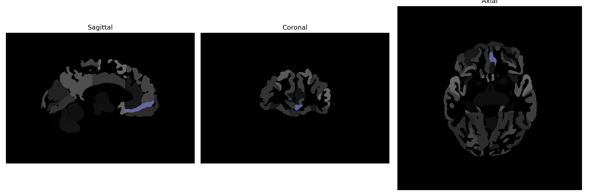

# medial-frontal-cortex

## Overview

The Left medial-frontal cortex is a segment of the prefrontal cortex situated within the frontal lobe of the brain. It plays a pivotal role in higher cognitive functions including decision making, attention, and modulation of social behavior. This area is also involved in emotional regulation and the processing of complex tasks that require integration of various cognitive processes. The medial-frontal cortex is interconnected with several subcortical structures and other cortical regions, facilitating communication across different areas of the brain for coordinated output and response. The left medial aspect is often associated with certain asymmetries in cognitive processing seen in hemispheric lateralization.

There is no direct Wikipedia link to the Left medial-frontal cortex as specified by the brainCOLOR Atlas. However, a related structure can be explored through the general page on the prefrontal cortex: [https://en.wikipedia.org/wiki/Prefrontal_cortex](https://en.wikipedia.org/wiki/Prefrontal_cortex).

*Overview generated by GPT-4o (2026).*

---

**Region ID:** 59  
**Hemisphere:** Left  
**Atlas:** brainCOLOR 

---

## Full Brain – Black Background

**Full Quality Version:** [Download MP4](full_black.mp4)

---

## Full Brain – White Background

**Full Quality Version:** [Download MP4](full_white.mp4)

---

## Hemisphere Only – Black Background

**Full Quality Version:** [Download MP4](hemi_black.mp4)

---

## Hemisphere Only – White Background

**Full Quality Version:** [Download MP4](hemi_white.mp4)

---

## Triplanar View (Centered on ROI)

