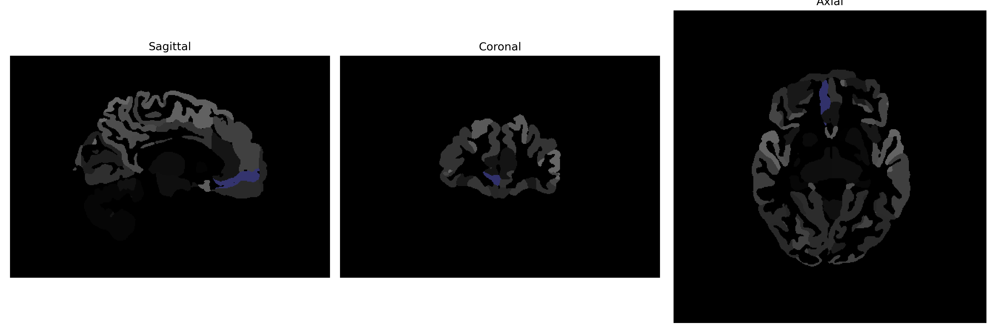

# medial-frontal-cortex

## Overview

The right medial frontal cortex is a critical region of the brain located in the frontal lobe and plays an essential role in various high-level functions, including decision-making, working memory, and social cognition. This region is part of the medial prefrontal cortex, known for its involvement in processing complex cognitive tasks, emotional regulation, and personality expression. Additionally, the right medial frontal cortex contributes to executive functions by integrating information from different parts of the brain, thereby facilitating adaptive and goal-directed behavior. Its connections to other brain regions, such as the limbic system and basal ganglia, underscore its importance in emotional processing and motivational states.

There is no direct Wikipedia link to the Right medial-frontal-cortex brain region. However, there is related information available under the broader category of the "Medial prefrontal cortex" on Wikipedia: https://en.wikipedia.org/wiki/Medial_prefrontal_cortex

*Overview generated by GPT-4o (2026).*

---

**Region ID:** 58  
**Hemisphere:** Right  
**Atlas:** brainCOLOR 

---

## Full Brain – Black Background

**Full Quality Version:** [Download MP4](full_black.mp4)

---

## Full Brain – White Background

**Full Quality Version:** [Download MP4](full_white.mp4)

---

## Hemisphere Only – Black Background

**Full Quality Version:** [Download MP4](hemi_black.mp4)

---

## Hemisphere Only – White Background

**Full Quality Version:** [Download MP4](hemi_white.mp4)

---

## Triplanar View (Centered on ROI)

