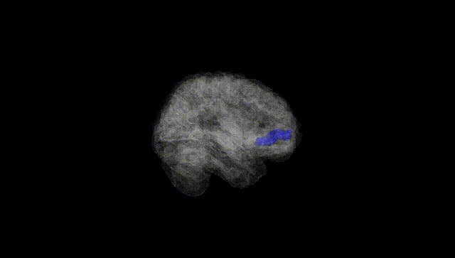
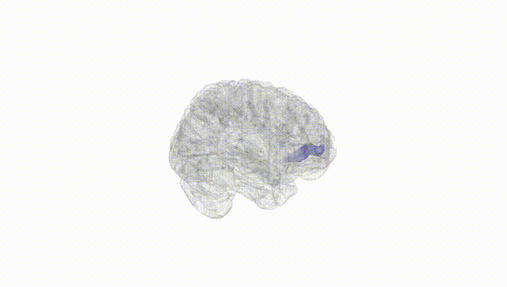
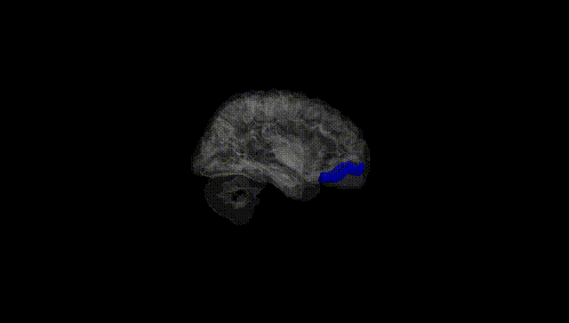
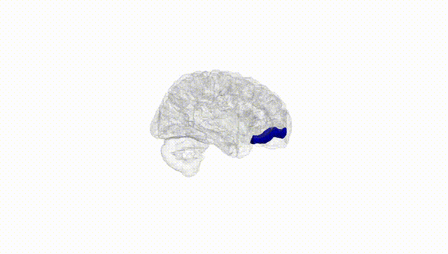
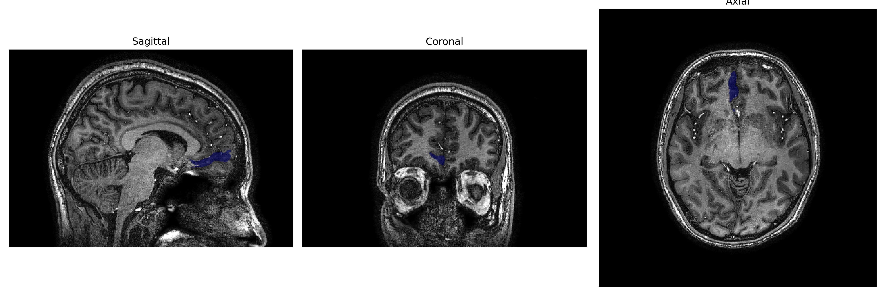
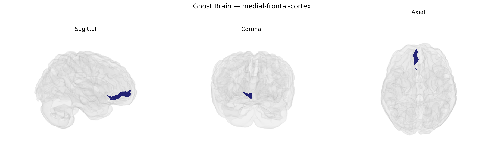

# medial-frontal-cortex
 
## Overview
 
The right medial frontal cortex is a region of the frontal lobe located on the medial surface of the right hemisphere, encompassing portions of the medial prefrontal cortex and anterior cingulate territory that are implicated in higher-order cognitive and affective processes. This area participates in executive control, performance monitoring, error detection, decision-making under uncertainty, and the regulation of internally guided behavior, as well as contributing to aspects of social cognition such as mentalizing and the evaluation of self-referential information. It is interconnected with limbic structures including the amygdala and hippocampus, subcortical nuclei such as the basal ganglia, and other prefrontal and parietal association areas, forming networks that integrate motivational, emotional, and cognitive signals to guide goal-directed behavior. There is no direct link for “Right medial-frontal-cortex”; a closely related structure is the [Medial prefrontal cortex](https://en.wikipedia.org/wiki/Medial_prefrontal_cortex).
 
The right medial frontal cortex, as defined in parcellations such as the brainCOLOR atlas, has been implicated in several genetic and GWAS-based findings related to higher-order cognition, psychiatric vulnerability, and personality traits. Large-scale imaging genetics consortia (e.g., ENIGMA, UK Biobank–based studies) have identified SNPs in and around genes involved in neuronal development, synaptic function, and myelination (including variants near genes such as MIR137, GRIN2B, and CACNA1C, among others) that are associated with cortical thickness, surface area, or volume in medial frontal regions, often bilaterally but sometimes with right-hemispheric or midline emphasis. Polygenic risk scores for schizophrenia, bipolar disorder, major depressive disorder, attention-deficit/hyperactivity disorder, and autism spectrum disorder have been associated with structural or functional alterations in medial frontal cortex, including the right medial sector, mirroring case–control MRI findings of abnormal anterior cingulate/medial prefrontal morphology and activation. GWAS of cognitive performance, educational attainment, and executive function show enrichment of associated variants in genes preferentially expressed in medial prefrontal/frontal regions, and imaging–genetics work links these polygenic profiles to variation in right medial frontal anatomy and task-related activation. Additional associations involve genetic risk for anxiety and neuroticism, where variants in stress-regulation and monoaminergic genes correlate with activity and connectivity patterns in medial prefrontal areas implicated in emotion regulation and self-referential processing. Overall, while few GWAS target the right medial frontal cortex in isolation, convergent evidence from structural and functional imaging genetics supports a role for common variants affecting synaptic plasticity, cortical development, and neurotransmission in shaping inter-individual differences in this region, with downstream links to major psychiatric disorders, cognitive traits, and affective phenotypes.
 
*Overview generated by GPT-4o (2026).*
 
---
 
**Region ID:** 58  
**Hemisphere:** Right  
**Atlas:** brainCOLOR 
 
---
 
## medial-frontal-cortex – Black Background (Full Brain)
 

 
**Full Quality Version:** <a href="full_black.mp4" download>Download MP4</a>
 
---
 
## medial-frontal-cortex – White Background (Full Brain)
 

 
**Full Quality Version:** <a href="full_white.mp4" download>Download MP4</a>
 
---

## medial-frontal-cortex – Black Background (Hemisphere)
 

 
**Full Quality Version:** <a href="hemi_black.mp4" download>Download MP4</a>
 
---
 
## medial-frontal-cortex – White Background (Hemisphere)
 

 
**Full Quality Version:** <a href="hemi_white.mp4" download>Download MP4</a>
 
---

## Triplanar View – T1 Background
 

 
---
 
## Triplanar View – Ghost Brain
 


