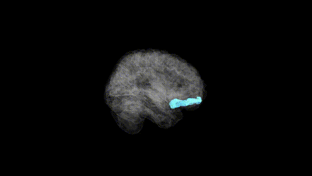
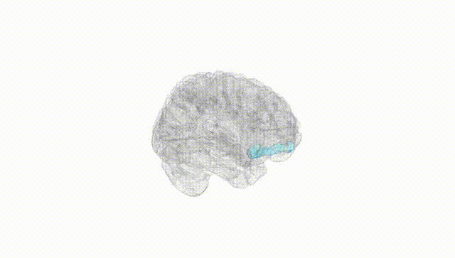
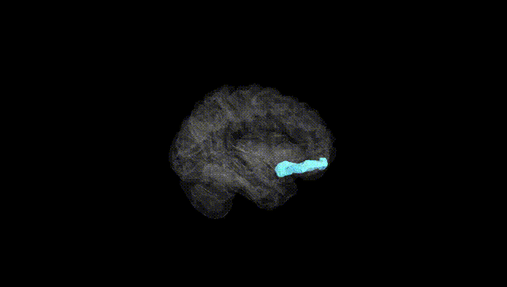
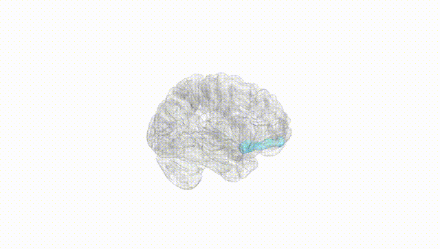
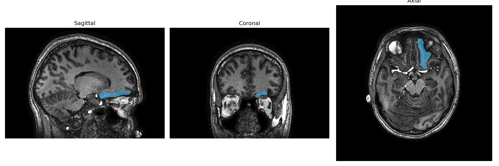
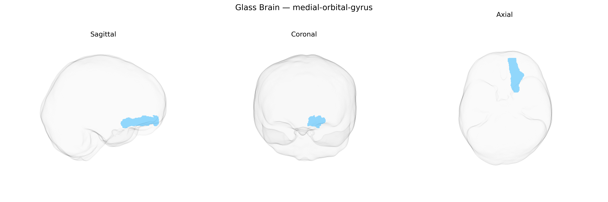

# medial-orbital-gyrus

## Overview

The left medial orbital gyrus is a cortical region on the ventromedial surface of the frontal lobe, forming part of the orbitofrontal cortex that lies directly above the orbits. In the brainCOLOR Atlas, it is defined anatomically by its position medial to the lateral orbital gyri and adjacent to the gyrus rectus and medial prefrontal cortex. This region participates in networks involved in valuation, reward-based decision-making, affective processing, and regulation of social and emotional behavior, integrating sensory and internal state information to guide flexible behavioral responses. Its connectivity includes reciprocal projections with limbic structures (such as the amygdala and ventral striatum), medial prefrontal and cingulate cortices, and sensory association areas, supporting its role in evaluating outcomes and updating expectations based on experience. There is no direct Wikipedia link specifically for the “medial orbital gyrus,” but it is commonly treated as part of the orbitofrontal cortex: https://en.wikipedia.org/wiki/Orbitofrontal_cortex.

*Overview generated by GPT-4o (2026).*

---

**Region ID:** 65  
**Hemisphere:** Left  
**Atlas:** brainCOLOR 

---

## medial-orbital-gyrus – Black Background (Full Brain)

**Full Quality Version:** [Download MP4](full_black.mp4)

---

## medial-orbital-gyrus – White Background (Full Brain)

**Full Quality Version:** [Download MP4](full_white.mp4)

---

## medial-orbital-gyrus – Black Background (Hemisphere)

**Full Quality Version:** [Download MP4](hemi_black.mp4)

---

## medial-orbital-gyrus – White Background (Hemisphere)

**Full Quality Version:** [Download MP4](hemi_white.mp4)

---

## Triplanar View – T1 Background

---

## Triplanar View – Ghost Brain


