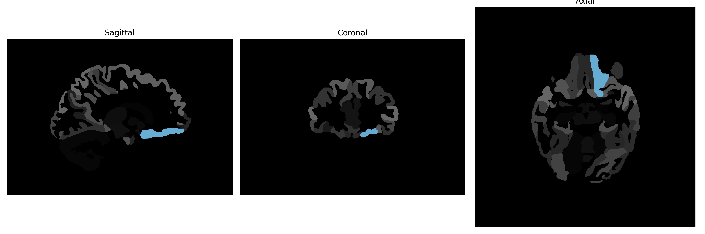

# medial-orbital-gyrus

## Overview

The left medial-orbital gyrus is a region located within the frontal lobe of the brain, specifically part of the orbitofrontal cortex. This area plays a crucial role in decision-making, emotion regulation, and reward processing. It is involved in integrating sensory and emotional information and is key to assessing the value of stimuli and guiding behavior based on predicted outcomes. The medial-orbital gyrus has strong connections with other limbic structures, influencing emotional responses and social behavior. The activity within this region is essential for maintaining adaptive social and emotional interactions.

There is no direct Wikipedia link for the left medial-orbital gyrus. A related article is available about the orbitofrontal cortex: https://en.wikipedia.org/wiki/Orbitofrontal_cortex

*Overview generated by GPT-4o (2026).*

---

**Region ID:** 65  
**Hemisphere:** Left  
**Atlas:** brainCOLOR 

---

## Full Brain – Black Background

**Full Quality Version:** [Download MP4](full_black.mp4)

---

## Full Brain – White Background

**Full Quality Version:** [Download MP4](full_white.mp4)

---

## Hemisphere Only – Black Background

**Full Quality Version:** [Download MP4](hemi_black.mp4)

---

## Hemisphere Only – White Background

**Full Quality Version:** [Download MP4](hemi_white.mp4)

---

## Triplanar View (Centered on ROI)

