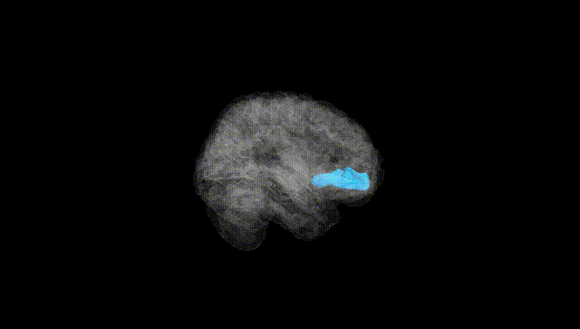
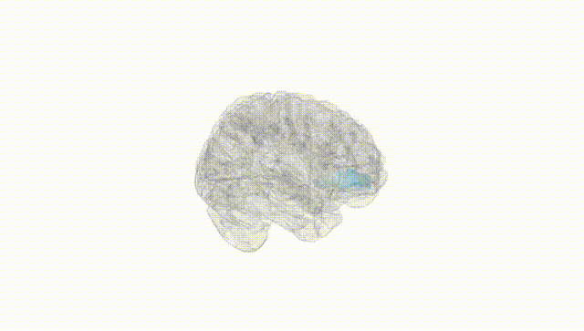
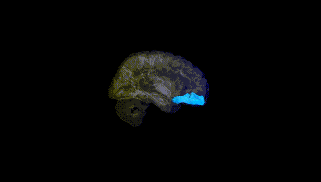
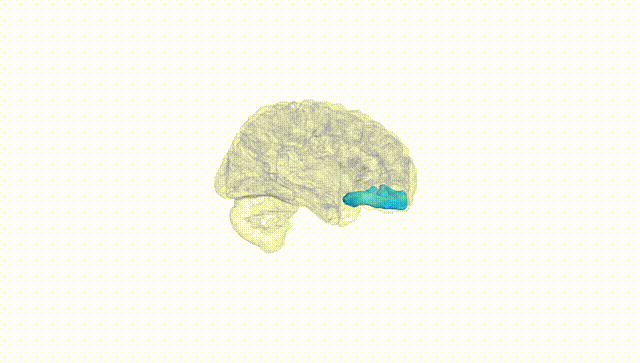
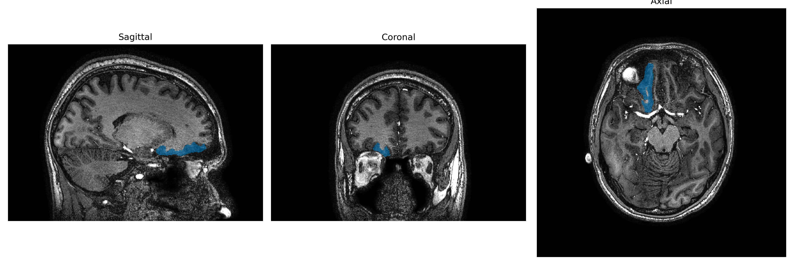
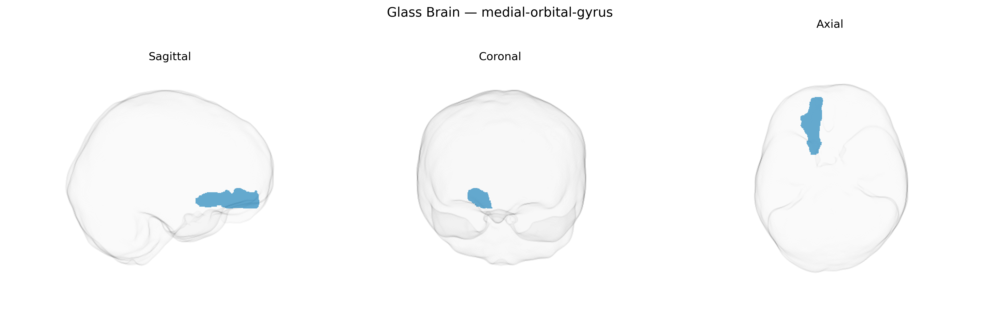

# medial-orbital-gyrus
 
## Overview
 
The Right medial-orbital-gyrus corresponds to the medial portion of the orbitofrontal cortex on the ventral surface of the right frontal lobe, overlying the orbital plate of the frontal bone and situated above the orbits. Cytoarchitectonically, it forms part of the prefrontal cortex and is interconnected with limbic, sensory, and autonomic structures, including the amygdala, hippocampal formation, hypothalamus, and medial thalamic nuclei. Functionally, this region contributes to reward valuation, affective decision-making, response inhibition, and the integration of visceral and emotional signals into goal-directed behavior. It is implicated in processing incentive salience, updating stimulus–reward contingencies, and modulating social and moral judgments, and is frequently involved in neuropsychiatric conditions such as mood disorders, obsessive–compulsive disorder, and addiction. There is no direct Wikipedia article for the medial orbital gyrus; a closely related structure is the [Orbitofrontal cortex](https://en.wikipedia.org/wiki/Orbitofrontal_cortex).
 
The right medial orbital gyrus, part of the ventromedial prefrontal/orbitofrontal cortex in the brainCOLOR atlas, has been implicated in several genetic and GWAS-based associations, primarily through its roles in reward processing, valuation, and affect regulation. Imaging genetics studies link common variants in genes involved in dopamine (e.g., DRD2, COMT), serotonin (e.g., SLC6A4/5-HTTLPR, HTR2A), and glutamate signaling (e.g., GRM3) to structural or functional variation in medial orbitofrontal/ventromedial prefrontal regions that encompass this gyrus. Large-scale neuroimaging GWAS (e.g., ENIGMA, UK Biobank) have identified genome-wide significant loci for cortical thickness, surface area, and functional connectivity in orbitofrontal and medial prefrontal territories, including variants near genes such as POU3F2, TCF4, and MAPT, though these are often reported at the level of broader orbital or frontal parcels rather than the specific right medial orbital gyrus. Genetic correlations and polygenic risk score analyses indicate that orbitofrontal/medial prefrontal measures are influenced by variants contributing to major depressive disorder, bipolar disorder, schizophrenia, and substance use traits, consistent with lesion and functional MRI evidence implicating this region in mood regulation and addiction. Additional associations involve personality and affective traits (e.g., neuroticism, risk-taking, impulsivity), obesity and eating behavior, and economic decision-making phenotypes, where GWAS-derived polygenic scores predict structural and functional variance in medial orbitofrontal territories. Overall, current evidence suggests that the genetic architecture of the right medial orbital gyrus is highly polygenic, overlaps with risk loci for common psychiatric and behavioral traits, and converges on neurotransmission, synaptic plasticity, and neurodevelopmental pathways, though locus-level specificity for this exact atlas-defined parcel remains limited.
 
*Overview generated by GPT-4o (2026).*
 
---
 
**Region ID:** 64  
**Hemisphere:** Right  
**Atlas:** brainCOLOR 
 
---
 
## medial-orbital-gyrus – Black Background (Full Brain)
 

 
**Full Quality Version:** <a href="full_black.mp4" download>Download MP4</a>
 
---
 
## medial-orbital-gyrus – White Background (Full Brain)
 

 
**Full Quality Version:** <a href="full_white.mp4" download>Download MP4</a>
 
---

## medial-orbital-gyrus – Black Background (Hemisphere)
 

 
**Full Quality Version:** <a href="hemi_black.mp4" download>Download MP4</a>
 
---
 
## medial-orbital-gyrus – White Background (Hemisphere)
 

 
**Full Quality Version:** <a href="hemi_white.mp4" download>Download MP4</a>
 
---

## Triplanar View – T1 Background
 

 
---
 
## Triplanar View – Ghost Brain
 


