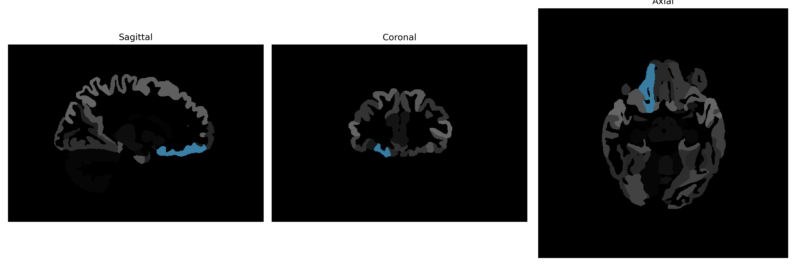

# medial-orbital-gyrus

## Overview

The right medial-orbital gyrus is a part of the frontal lobe located within the prefrontal cortex, known for its involvement in high-level cognitive functions and emotional processing. It is situated medially in the orbitofrontal cortex, near the intersection of the frontal and temporal lobes. This region plays a critical role in decision-making, impulse control, and the integration of sensory experiences with emotional responses. Furthermore, it contributes to the evaluation of anticipated rewards and punishments, influencing social behavior and personality. The medial-orbital gyrus is also connected to areas that regulate autonomic functions, linking physiological states with emotional and cognitive processes.

There is no direct Wikipedia link for the right medial-orbital gyrus specifically. However, a related structure is the orbitofrontal cortex, which can provide additional context: [https://en.wikipedia.org/wiki/Orbitofrontal_cortex](https://en.wikipedia.org/wiki/Orbitofrontal_cortex).

*Overview generated by GPT-4o (2026).*

---

**Region ID:** 64  
**Hemisphere:** Right  
**Atlas:** brainCOLOR 

---

## Full Brain – Black Background

**Full Quality Version:** [Download MP4](full_black.mp4)

---

## Full Brain – White Background

**Full Quality Version:** [Download MP4](full_white.mp4)

---

## Hemisphere Only – Black Background

**Full Quality Version:** [Download MP4](hemi_black.mp4)

---

## Hemisphere Only – White Background

**Full Quality Version:** [Download MP4](hemi_white.mp4)

---

## Triplanar View (Centered on ROI)

