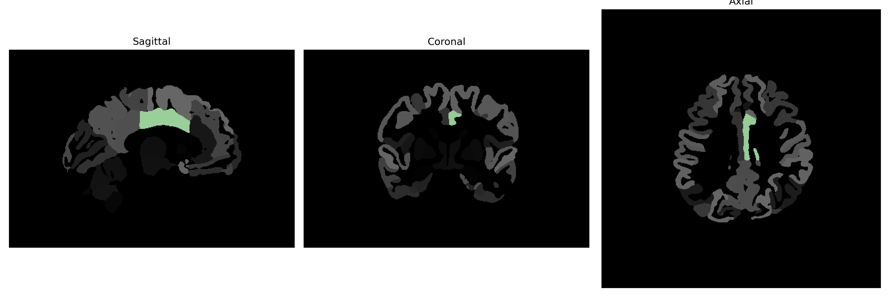

# middle-cingulate-gyrus

## Overview

The left middle-cingulate gyrus is a component of the cingulate cortex located within the medial aspect of the cerebral hemispheres, situated between the corpus callosum and the frontal and parietal lobes. This region is part of the limbic system and plays a critical role in various cognitive and emotional processes. It is involved in functions such as impulse control, decision-making, and emotional regulation. The middle-cingulate gyrus is also associated with pain perception and motor control, contributing to the integration of sensory and movement information. Its position allows it to be a vital area for the coordination between cognitive and emotional responses.

There is no direct Wikipedia link for the left middle-cingulate gyrus specifically. However, a related link to the cingulate cortex can be found here: https://en.wikipedia.org/wiki/Cingulate_cortex

*Overview generated by GPT-4o (2026).*

---

**Region ID:** 57  
**Hemisphere:** Left  
**Atlas:** brainCOLOR 

---

## Full Brain – Black Background

**Full Quality Version:** [Download MP4](full_black.mp4)

---

## Full Brain – White Background

**Full Quality Version:** [Download MP4](full_white.mp4)

---

## Hemisphere Only – Black Background

**Full Quality Version:** [Download MP4](hemi_black.mp4)

---

## Hemisphere Only – White Background

**Full Quality Version:** [Download MP4](hemi_white.mp4)

---

## Triplanar View (Centered on ROI)

