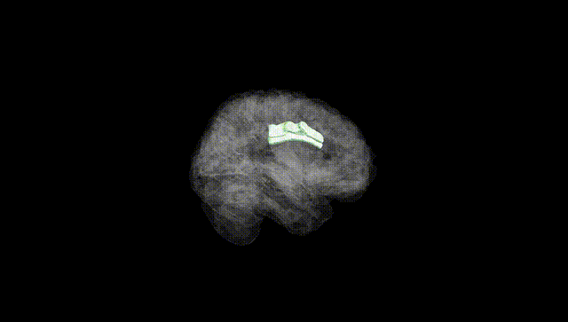
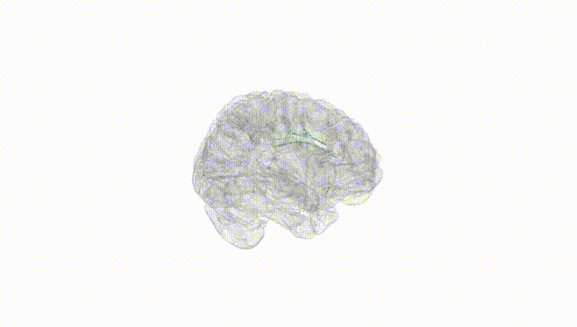
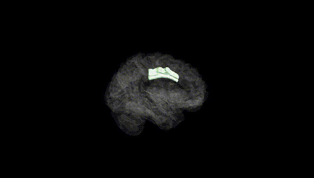
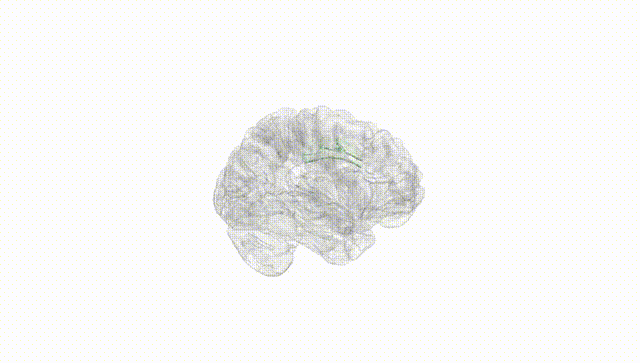
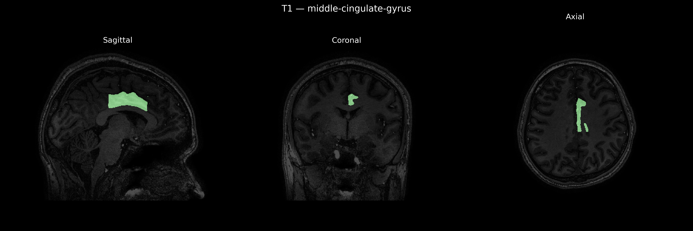
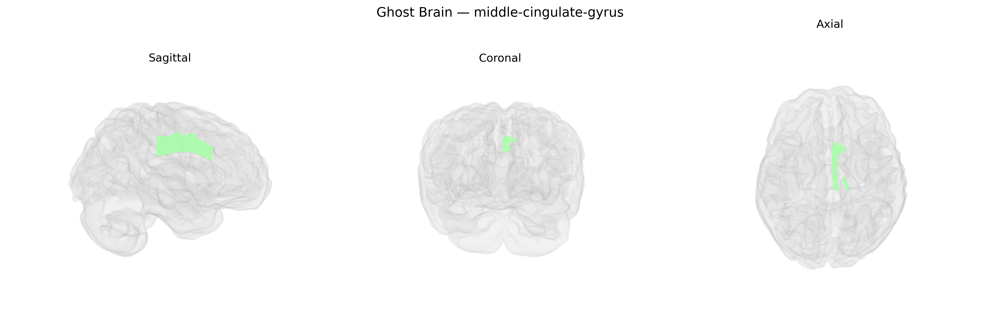

# middle-cingulate-gyrus

## Overview

The left middle cingulate gyrus is a medial cortical region located within the cingulate cortex, dorsal to the corpus callosum and situated between the anterior and posterior cingulate areas, corresponding approximately to the mid-portion of Brodmann areas 24 and 32. It forms part of the limbic and paralimbic system and is strongly interconnected with prefrontal, premotor, parietal, and subcortical structures, including the thalamus and basal ganglia. Functionally, the middle cingulate gyrus is implicated in cognitive control, response selection, performance monitoring, and motor preparation, as well as in the affective-motivational dimension of pain and action–outcome evaluation. Lateralization to the left hemisphere may contribute to integration of these control and evaluative processes with language-related and analytic functions, given broader left-hemisphere specializations.

There is no direct Wikipedia link for “Left middle-cingulate-gyrus” as a distinct entry; a related structure is the cingulate gyrus: https://en.wikipedia.org/wiki/Cingulate_gyrus

*Overview generated by GPT-4o (2026).*

---

**Region ID:** 57  
**Hemisphere:** Left  
**Atlas:** brainCOLOR 

---

## Full Brain – Black Background

**Full Quality Version:** [Download MP4](full_black.mp4)

---

## Full Brain – White Background

**Full Quality Version:** [Download MP4](full_white.mp4)

---

## Hemisphere Only – Black Background

**Full Quality Version:** [Download MP4](hemi_black.mp4)

---

## Hemisphere Only – White Background

**Full Quality Version:** [Download MP4](hemi_white.mp4)

---

## Triplanar View – T1 Background

---

## Triplanar View – Ghost Brain


