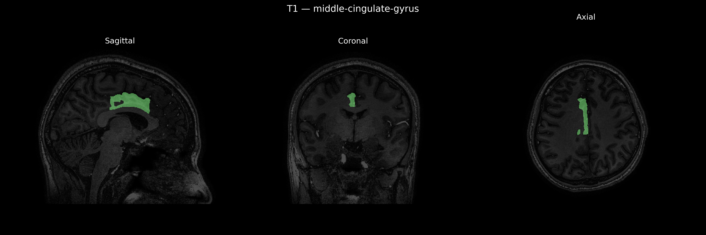
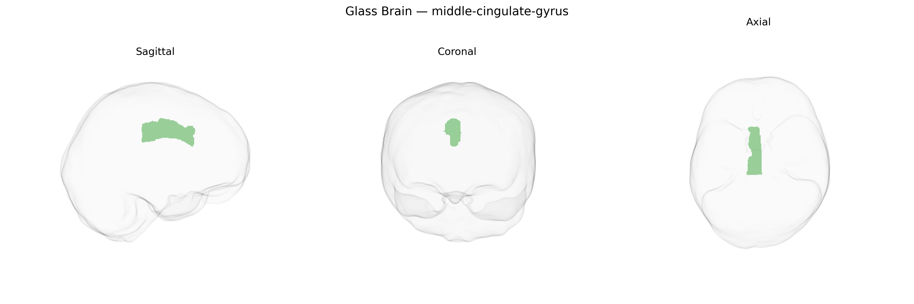

# middle-cingulate-gyrus
 
## Overview
 
The Right middle-cingulate-gyrus, as defined in the brainCOLOR Atlas, corresponds to a segment of the mid-portion of the cingulate gyrus located on the medial surface of the right cerebral hemisphere, arching above the corpus callosum. It lies between the anterior and posterior divisions of the cingulate cortex and is commonly associated with the “mid-cingulate cortex,” which participates in cognitive control, performance monitoring, response selection, and aspects of pain processing and motor planning. Cytoarchitectonically, this region is part of the cingulate cortex rather than primary sensory or motor areas, and it maintains rich connections with prefrontal, premotor, parietal, and limbic regions, integrating motivational and attentional signals to influence goal-directed behavior. There is no direct Wikipedia article specific to the “Right middle-cingulate-gyrus”; a closely related structure is the [Cingulate cortex](https://en.wikipedia.org/wiki/Cingulate_cortex).
 
The right middle cingulate gyrus, as defined in parcellations such as the brainCOLOR Atlas, has been implicated in genetic studies primarily through its roles in pain processing, cognitive control, and affect regulation, although region-specific GWAS data are often reported at coarser cingulate or midcingulate levels rather than this exact subregion. Twin and SNP-heritability studies of cortical thickness, surface area, and functional connectivity consistently show moderate to high heritability in midcingulate areas, and large neuroimaging GWAS (e.g., ENIGMA and UK Biobank–based analyses) have identified common variants near genes involved in synaptic function, neurodevelopment, and myelination (such as MIR137, MAPT-region loci, and other brain-expressed genes) that influence cingulate morphology and connectivity, sometimes spanning the right middle cingulate gyrus parcel. Genetic correlations link midcingulate structure and function with risk for major depressive disorder, schizophrenia, bipolar disorder, ADHD, and anxiety traits, as well as personality dimensions like neuroticism and cognitive traits including general intelligence and executive function. Pain-related GWAS and candidate-gene work (e.g., involving COMT and OPRM1) converge with imaging genetics to implicate the midcingulate in genetically influenced variability in pain sensitivity, chronic pain vulnerability, and placebo analgesia. However, current evidence is largely indirect for the specific right middle cingulate gyrus region of the brainCOLOR Atlas, with most findings derived from broader cingulate or midcingulate labels and requiring finer-grained, atlas-aligned imaging-genetic analyses for precise regional attribution.
 
*Overview generated by GPT-4o (2026).*
 
---
 
**Region ID:** 56  
**Hemisphere:** Right  
**Atlas:** brainCOLOR 
 
---
 
## middle-cingulate-gyrus – Black Background (Full Brain)
 

 
**Full Quality Version:** <a href="full_black.mp4" download>Download MP4</a>
 
---
 
## middle-cingulate-gyrus – White Background (Full Brain)
 

 
**Full Quality Version:** <a href="full_white.mp4" download>Download MP4</a>
 
---

## middle-cingulate-gyrus – Black Background (Hemisphere)
 

 
**Full Quality Version:** <a href="hemi_black.mp4" download>Download MP4</a>
 
---
 
## middle-cingulate-gyrus – White Background (Hemisphere)
 

 
**Full Quality Version:** <a href="hemi_white.mp4" download>Download MP4</a>
 
---

## Triplanar View – T1 Background
 

 
---
 
## Triplanar View – Ghost Brain
 


