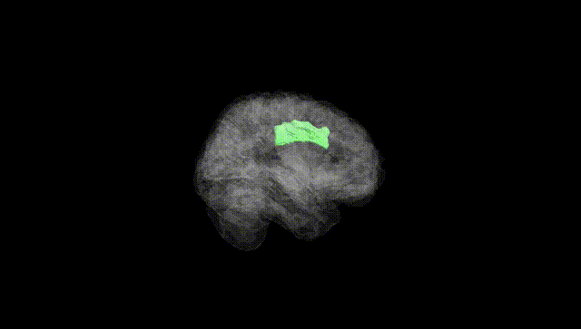
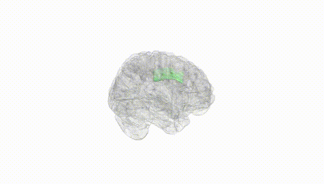
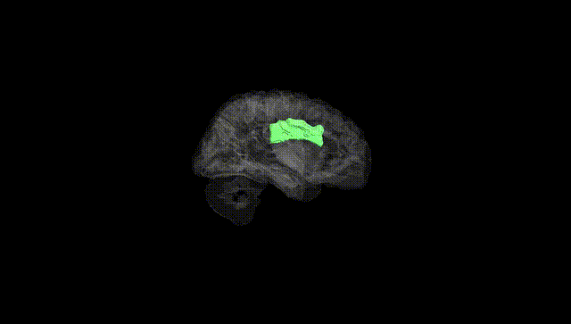
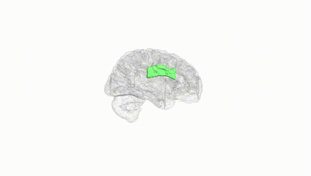
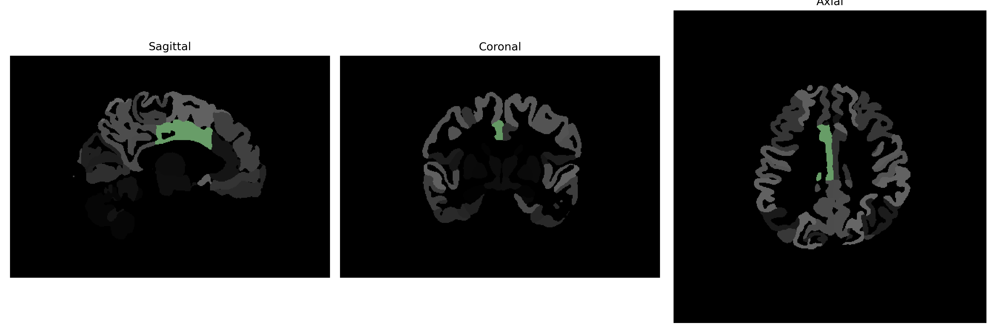

# middle-cingulate-gyrus

## Overview

The Right Middle Cingulate Gyrus is a part of the cingulate cortex, located in the medial aspect of the cerebral cortex. It is involved in a variety of cognitive and emotional processing functions, including attention allocation, emotion regulation, and in pain perception. This region is known to play a role in the integration of sensory input with emotional and motivational responses. Anatomically, it is situated within the cingulate gyrus, which arches over the corpus callosum, and is connected with other regions of the limbic system, contributing to its role in emotion and behavior.

There is no direct link for the Right Middle Cingulate Gyrus from the Wikipedia, but related information can be found here: [Cingulate Cortex](https://en.wikipedia.org/wiki/Cingulate_cortex).

*Overview generated by GPT-4o (2026).*

---

**Region ID:** 56  
**Hemisphere:** Right  
**Atlas:** brainCOLOR 

---

## Full Brain – Black Background

**Full Quality Version:** [Download MP4](full_black.mp4)

---

## Full Brain – White Background

**Full Quality Version:** [Download MP4](full_white.mp4)

---

## Hemisphere Only – Black Background

**Full Quality Version:** [Download MP4](hemi_black.mp4)

---

## Hemisphere Only – White Background

**Full Quality Version:** [Download MP4](hemi_white.mp4)

---

## Triplanar View (Centered on ROI)

