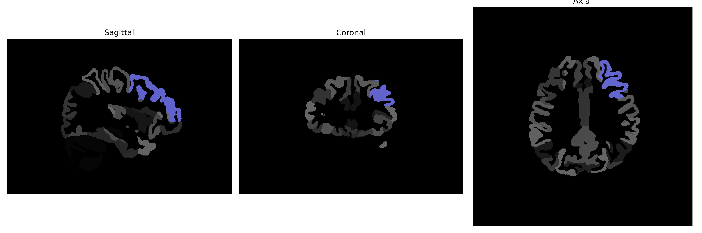

# middle-frontal-gyrus

## Overview

The left middle frontal gyrus is a distinct region within the frontal lobe of the cerebral cortex, situated anterior to the precentral sulcus and superior to the inferior frontal sulcus. Critical for executive functions, it plays a key role in working memory and cognitive flexibility. The middle frontal gyrus is involved in various higher cognitive processes, such as planning, problem-solving, and attention regulation. It integrates sensory information with motor instructions and is engaged in complex tasks requiring coordination across multiple domains of thinking. Neuroimaging studies often reveal activation in this region during tasks demanding novel solutions and strategic planning.

There is no direct link to the left middle frontal gyrus on Wikipedia. However, a related area, the frontal lobe, can be explored via this link: https://en.wikipedia.org/wiki/Frontal_lobe

*Overview generated by GPT-4o (2026).*

---

**Region ID:** 61  
**Hemisphere:** Left  
**Atlas:** brainCOLOR 

---

## Full Brain – Black Background

**Full Quality Version:** [Download MP4](full_black.mp4)

---

## Full Brain – White Background

**Full Quality Version:** [Download MP4](full_white.mp4)

---

## Hemisphere Only – Black Background

**Full Quality Version:** [Download MP4](hemi_black.mp4)

---

## Hemisphere Only – White Background

**Full Quality Version:** [Download MP4](hemi_white.mp4)

---

## Triplanar View (Centered on ROI)

