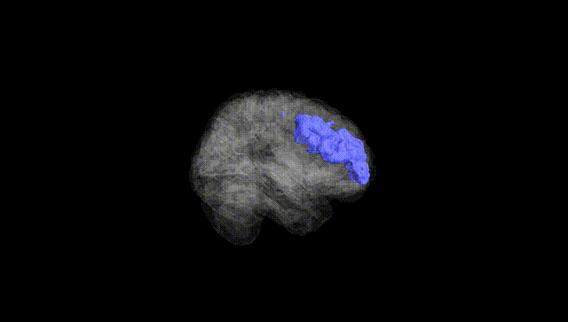
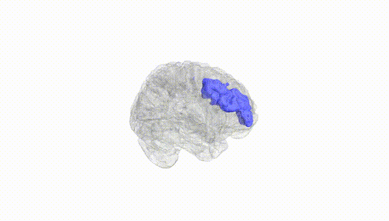
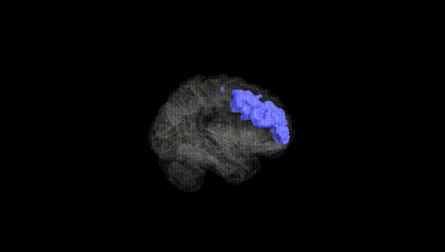
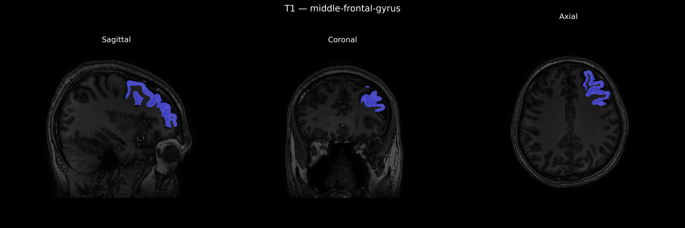
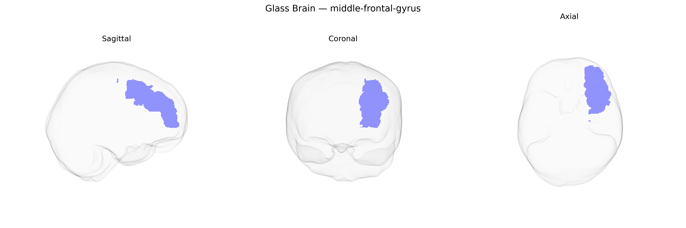

# middle-frontal-gyrus
 
## Overview
 
The left middle frontal gyrus is a dorsolateral prefrontal cortical region located in the frontal lobe, bounded superiorly by the superior frontal gyrus and inferiorly by the inferior frontal gyrus, and extending anteriorly from the precentral sulcus toward the frontal pole. It is predominantly supplied by branches of the middle cerebral artery and contains portions of Brodmann areas commonly associated with executive control, working memory, attentional selection, and higher-order cognitive integration, particularly in the verbal and symbolic domains in the left hemisphere. Cytoarchitectonically, it forms part of the lateral prefrontal cortex and is heavily interconnected with other frontal regions, parietal association cortex, basal ganglia, and thalamic nuclei, supporting its role in goal-directed behavior, planning, and the top-down modulation of sensorimotor and language-related processes. There is no direct Wikipedia article for this exact region; see the related area [Middle frontal gyrus](https://en.wikipedia.org/wiki/Middle_frontal_gyrus).
 
Genetic associations involving the left middle frontal gyrus (LMFG), as defined in parcellations such as the brainCOLOR atlas, largely emerge from imaging–genetics and GWAS studies of cortical thickness, surface area, and activation phenotypes rather than from region-specific candidate-gene work; loci in or near genes involved in neurodevelopment, synaptic function, and neuronal migration (for example, MIR137, FOXP2-related pathways, and genes within the major histocompatibility complex region) have been implicated in variation of prefrontal morphology that includes the LMFG. Large-scale ENIGMA and UK Biobank–based GWAS have identified multiple genome-wide significant loci affecting frontal lobe cortical thickness and surface area, some of which map onto the middle frontal gyrus or combined dorsolateral prefrontal regions and overlap with risk loci for schizophrenia, bipolar disorder, major depressive disorder, and ADHD. Polygenic risk scores for schizophrenia and depression show replicated associations with reduced prefrontal, including middle frontal, cortical thickness and altered functional activation during working-memory and cognitive-control tasks, while autism spectrum disorder and obsessive–compulsive disorder risk variants have also been linked to atypical prefrontal structure or connectivity patterns involving LMFG. Additionally, variants in dopamine- and glutamate-related genes (such as COMT and GRM3), though not specific to LMFG, have been repeatedly associated with differences in dorsolateral prefrontal activation and executive function, phenotypes that rely heavily on the left middle frontal gyrus, further supporting a convergent genetic influence on this region’s structure and function across multiple psychiatric and cognitive traits.
 
*Overview generated by GPT-4o (2026).*
 
---
 
**Region ID:** 61  
**Hemisphere:** Left  
**Atlas:** brainCOLOR 
 
---
 
## middle-frontal-gyrus – Black Background (Full Brain)
 

 
**Full Quality Version:** <a href="full_black.mp4" download>Download MP4</a>
 
---
 
## middle-frontal-gyrus – White Background (Full Brain)
 

 
**Full Quality Version:** <a href="full_white.mp4" download>Download MP4</a>
 
---

## middle-frontal-gyrus – Black Background (Hemisphere)
 

 
**Full Quality Version:** <a href="hemi_black.mp4" download>Download MP4</a>
 
---
 
## middle-frontal-gyrus – White Background (Hemisphere)
 

 
**Full Quality Version:** <a href="hemi_white.mp4" download>Download MP4</a>
 
---

## Triplanar View – T1 Background
 

 
---
 
## Triplanar View – Ghost Brain
 


