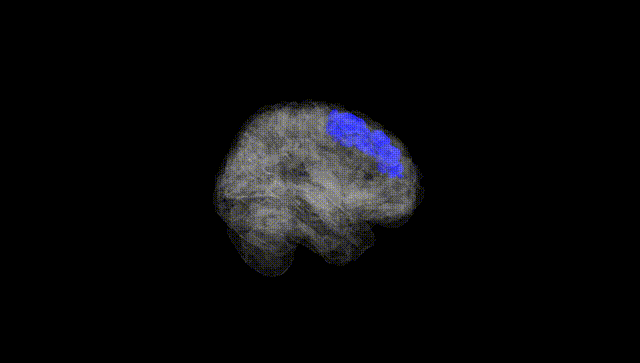
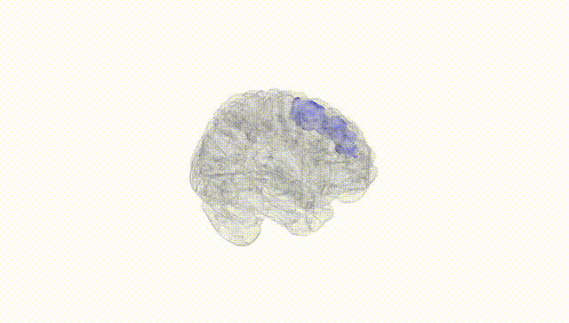
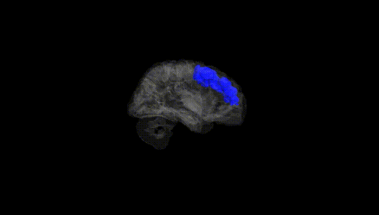
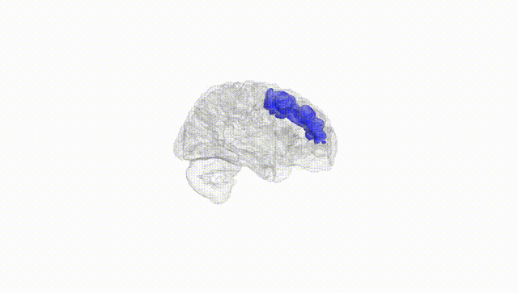
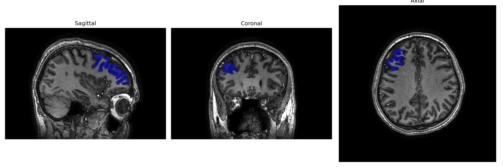
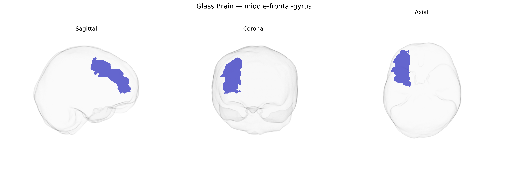

# middle-frontal-gyrus
 
## Overview
 
The Right middle-frontal gyrus is a lateral prefrontal cortical region located in the frontal lobe, situated between the superior and inferior frontal gyri and extending anteriorly from the precentral sulcus toward the frontal pole. It is cytoarchitectonically heterogeneous, containing portions of dorsolateral prefrontal cortex that participate in higher-order executive functions, including working memory, attention control, planning, and decision-making, as well as aspects of cognitive flexibility and goal-directed behavior. This region is highly interconnected with other prefrontal areas, parietal association cortex, basal ganglia, and thalamus, forming part of large-scale frontoparietal control networks that modulate behavior according to internal goals and external demands. Hemispheric specialization may lead the right middle-frontal gyrus to be particularly important for spatial attention, monitoring, and inhibitory control. [Middle frontal gyrus](https://en.wikipedia.org/wiki/Middle_frontal_gyrus)
 
The right middle frontal gyrus, as defined in the brainCOLOR Atlas, has been implicated in several genetic and genome-wide association studies, particularly those examining cognitive performance, executive function, and brain structural variation. Multiple large-scale GWAS of cortical thickness and surface area (e.g., ENIGMA, UK Biobank–based studies) have identified common variants in genes involved in neurodevelopment and synaptic function (such as MIR137, CNTNAP2, GRIN2B, and genes in the MAPT and APOE regions) that are associated with morphology or activation patterns in right dorsolateral prefrontal regions overlapping the right middle frontal gyrus. This region is frequently highlighted in imaging-genetics studies of psychiatric and neurodevelopmental disorders—including schizophrenia, bipolar disorder, major depressive disorder, ADHD, and autism spectrum disorder—where polygenic risk scores and disorder-associated loci correlate with altered volume, cortical thickness, or functional connectivity in the right middle frontal gyrus. Additionally, GWAS of traits such as general cognitive ability, working memory, educational attainment, and risk-taking have linked their polygenic architectures to structural and functional measures in this region, suggesting a convergence between genetic influences on higher-order cognition and the integrity of the right middle frontal gyrus.
 
*Overview generated by GPT-4o (2026).*
 
---
 
**Region ID:** 60  
**Hemisphere:** Right  
**Atlas:** brainCOLOR 
 
---
 
## middle-frontal-gyrus – Black Background (Full Brain)
 

 
**Full Quality Version:** <a href="full_black.mp4" download>Download MP4</a>
 
---
 
## middle-frontal-gyrus – White Background (Full Brain)
 

 
**Full Quality Version:** <a href="full_white.mp4" download>Download MP4</a>
 
---

## middle-frontal-gyrus – Black Background (Hemisphere)
 

 
**Full Quality Version:** <a href="hemi_black.mp4" download>Download MP4</a>
 
---
 
## middle-frontal-gyrus – White Background (Hemisphere)
 

 
**Full Quality Version:** <a href="hemi_white.mp4" download>Download MP4</a>
 
---

## Triplanar View – T1 Background
 

 
---
 
## Triplanar View – Ghost Brain
 


