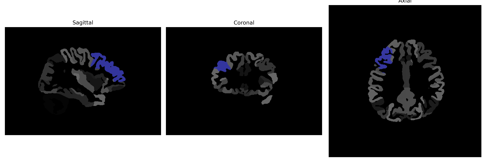

# middle-frontal-gyrus

## Overview

The right middle-frontal-gyrus is a region within the frontal lobe of the human brain, playing a significant role in executive functions, cognitive control, decision making, and working memory. It encompasses part of the dorsolateral prefrontal cortex (DLPFC), which is critical for high-level cognitive processes. In neuroimaging studies, the right middle-frontal-gyrus is often associated with tasks that require attention, problem-solving, and planning. Its anatomical positioning lies lateral to the superior frontal gyrus and superior to the inferior frontal gyrus, extending from the precentral sulcus to the frontopolar region.

There is no direct Wikipedia link to the right middle-frontal-gyrus. However, related information can be found by exploring the broader area of the prefrontal cortex: [Prefrontal Cortex - Wikipedia](https://en.wikipedia.org/wiki/Prefrontal_cortex).

*Overview generated by GPT-4o (2026).*

---

**Region ID:** 60  
**Hemisphere:** Right  
**Atlas:** brainCOLOR 

---

## Full Brain – Black Background

**Full Quality Version:** [Download MP4](full_black.mp4)

---

## Full Brain – White Background

**Full Quality Version:** [Download MP4](full_white.mp4)

---

## Hemisphere Only – Black Background

**Full Quality Version:** [Download MP4](hemi_black.mp4)

---

## Hemisphere Only – White Background

**Full Quality Version:** [Download MP4](hemi_white.mp4)

---

## Triplanar View (Centered on ROI)

