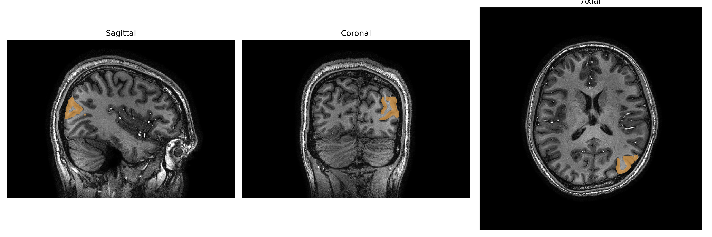
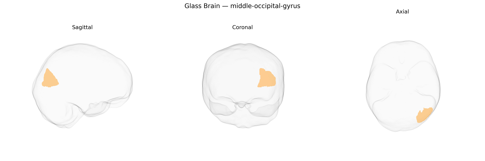

# middle-occipital-gyrus

## Overview

The left middle occipital gyrus is a cortical region located on the lateral surface of the occipital lobe, positioned between the superior and inferior occipital gyri and extending anteriorly toward the occipitotemporal junction. It consists predominantly of visual association cortex and participates in higher-order visual processing, including analysis of object form, motion, and visuospatial features, integrating input from primary visual areas (V1) and projecting to dorsal and ventral visual stream regions in parietal and temporal cortices. Functionally, this region contributes to visual recognition, visuospatial attention, and aspects of reading and visually guided behavior, with hemispheric lateralization sometimes reflected in language-related visual tasks when left-sided. Cytoarchitectonically, it encompasses parts of Brodmann areas such as BA 18 and 19, and it is heavily interconnected with extrastriate and multimodal association areas that support complex perception and visually based cognition. There is no direct Wikipedia link specifically for the “left middle occipital gyrus”; a related and encompassing structure is the occipital lobe: https://en.wikipedia.org/wiki/Occipital_lobe

*Overview generated by GPT-4o (2026).*

---

**Region ID:** 63  
**Hemisphere:** Left  
**Atlas:** brainCOLOR 

---

## middle-occipital-gyrus – Black Background (Full Brain)

**Full Quality Version:** [Download MP4](full_black.mp4)

---

## middle-occipital-gyrus – White Background (Full Brain)

**Full Quality Version:** [Download MP4](full_white.mp4)

---

## middle-occipital-gyrus – Black Background (Hemisphere)

**Full Quality Version:** [Download MP4](hemi_black.mp4)

---

## middle-occipital-gyrus – White Background (Hemisphere)

**Full Quality Version:** [Download MP4](hemi_white.mp4)

---

## Triplanar View – T1 Background

---

## Triplanar View – Ghost Brain


