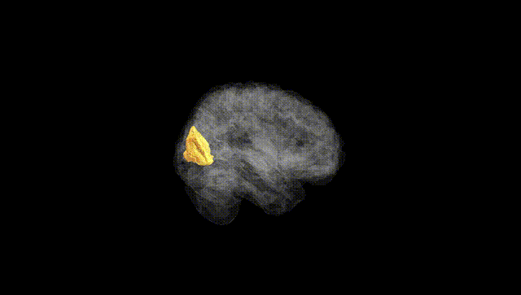
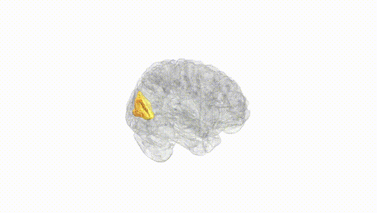
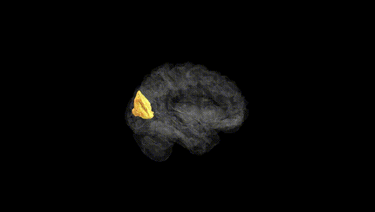
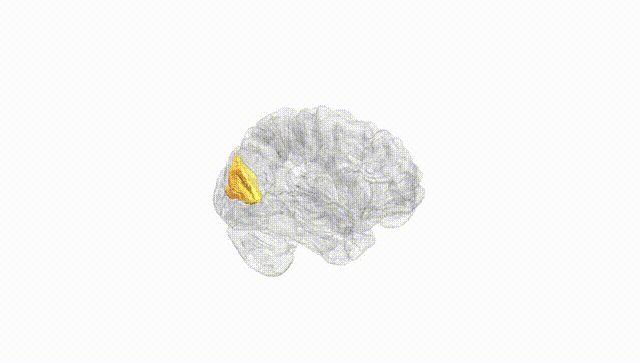
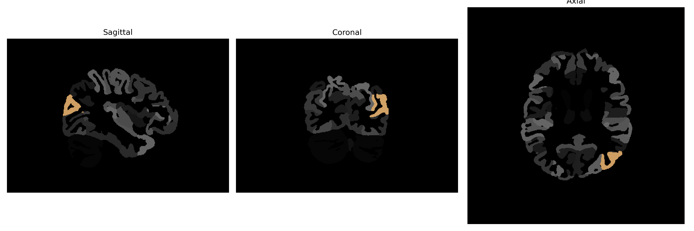

# middle-occipital-gyrus

## Overview

The left middle occipital gyrus is a region located within the occipital lobe of the brain, which is primarily involved in visual processing. As part of the broader occipital cortex, this gyrus participates in the interpretation of visual stimuli, helping with the perception of motion, color, and spatial orientation. The middle occipital gyrus receives visual information from the primary visual cortex and further processes it to contribute to complex visual tasks. It forms part of the pathway linking the visual data with attention and cognition, facilitating the integration of visual feedback with motor actions and cognitive responses.

There is no direct Wikipedia link to the "left middle occipital gyrus." However, a related structure within which it resides is the occipital lobe: https://en.wikipedia.org/wiki/Occipital_lobe.

*Overview generated by GPT-4o (2026).*

---

**Region ID:** 63  
**Hemisphere:** Left  
**Atlas:** brainCOLOR 

---

## Full Brain – Black Background

**Full Quality Version:** [Download MP4](full_black.mp4)

---

## Full Brain – White Background

**Full Quality Version:** [Download MP4](full_white.mp4)

---

## Hemisphere Only – Black Background

**Full Quality Version:** [Download MP4](hemi_black.mp4)

---

## Hemisphere Only – White Background

**Full Quality Version:** [Download MP4](hemi_white.mp4)

---

## Triplanar View (Centered on ROI)

