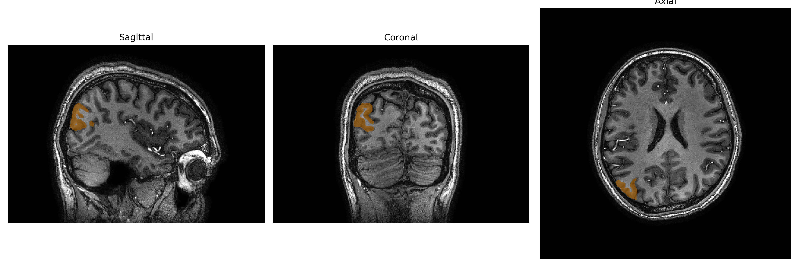
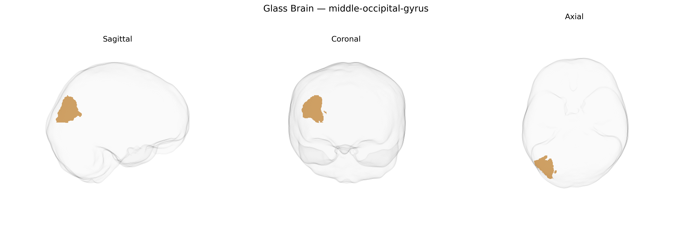

# middle-occipital-gyrus

## Overview

The right middle occipital gyrus is a lateral occipital cortical region located between the superior and inferior occipital gyri on the convexity of the occipital lobe, extending from near the occipital pole anteriorly toward the parieto-occipital and temporo-occipital junctions. Cytoarchitectonically, it overlaps with portions of the extrastriate visual cortex and participates in intermediate-to-high level visual processing, including analysis of object form, motion, and visuospatial features, often in interaction with dorsal (parietal) and ventral (temporal) visual streams. Functionally, the right hemisphere component is implicated in visuospatial attention, scene perception, and integration of visual information across the visual field, and it may contribute to processes underlying mental imagery and visually guided behavior. There is no direct Wikipedia page for the “right middle occipital gyrus” as a separate entry; a related and encompassing structure is the occipital lobe: https://en.wikipedia.org/wiki/Occipital_lobe.

*Overview generated by GPT-4o (2026).*

---

**Region ID:** 62  
**Hemisphere:** Right  
**Atlas:** brainCOLOR 

---

## middle-occipital-gyrus – Black Background (Full Brain)

**Full Quality Version:** [Download MP4](full_black.mp4)

---

## middle-occipital-gyrus – White Background (Full Brain)

**Full Quality Version:** [Download MP4](full_white.mp4)

---

## middle-occipital-gyrus – Black Background (Hemisphere)

**Full Quality Version:** [Download MP4](hemi_black.mp4)

---

## middle-occipital-gyrus – White Background (Hemisphere)

**Full Quality Version:** [Download MP4](hemi_white.mp4)

---

## Triplanar View – T1 Background

---

## Triplanar View – Ghost Brain


