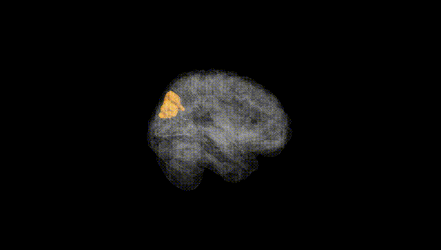
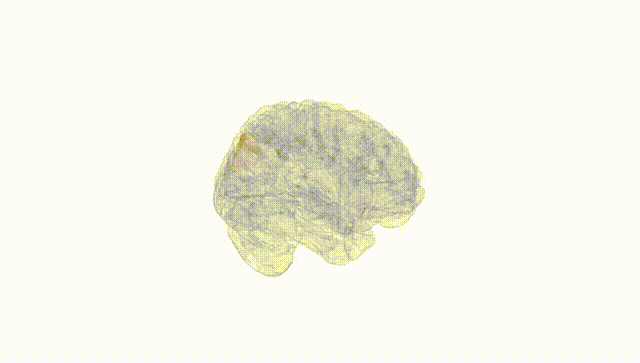
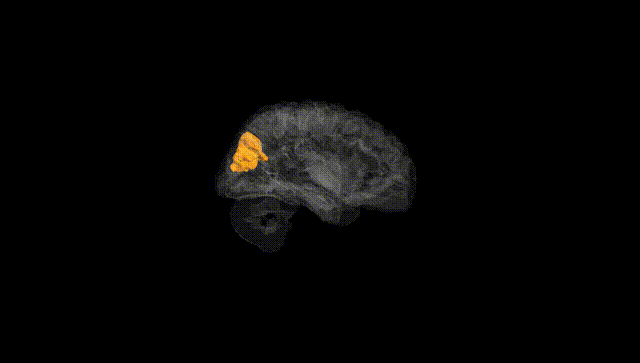
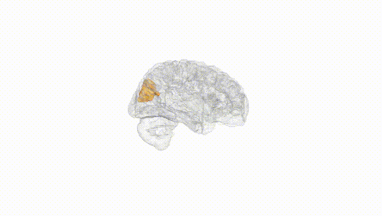
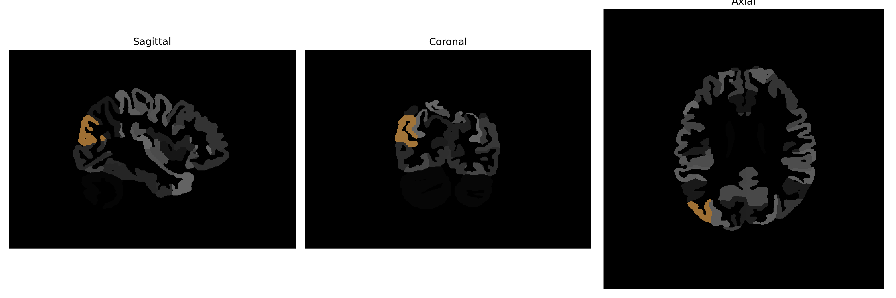

# middle-occipital-gyrus

## Overview

The Right Middle Occipital Gyrus is a brain region located within the occipital lobe, responsible primarily for processing visual information. It plays a crucial role in spatial awareness, perception of motion, and recognition of objects. As part of the occipital cortex, its functions are integral to interpreting and integrating visual stimuli received from the eyes, contributing to the conscious experience of the visual world. The organization within this gyrus displays specialized arrangements for distinct types of visual processing, reflecting its importance in visual perception pathways.

There is no direct Wikipedia link to the Right Middle Occipital Gyrus; however, the occipital lobe as a structure is well-covered. Here's the link to the general description of the occipital lobe: [Occipital Lobe Wikipedia](https://en.wikipedia.org/wiki/Occipital_lobe).

*Overview generated by GPT-4o (2026).*

---

**Region ID:** 62  
**Hemisphere:** Right  
**Atlas:** brainCOLOR 

---

## Full Brain – Black Background

**Full Quality Version:** [Download MP4](full_black.mp4)

---

## Full Brain – White Background

**Full Quality Version:** [Download MP4](full_white.mp4)

---

## Hemisphere Only – Black Background

**Full Quality Version:** [Download MP4](hemi_black.mp4)

---

## Hemisphere Only – White Background

**Full Quality Version:** [Download MP4](hemi_white.mp4)

---

## Triplanar View (Centered on ROI)

