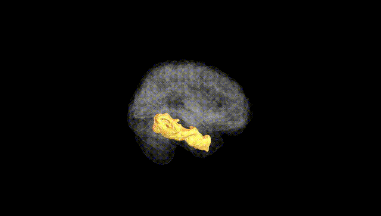
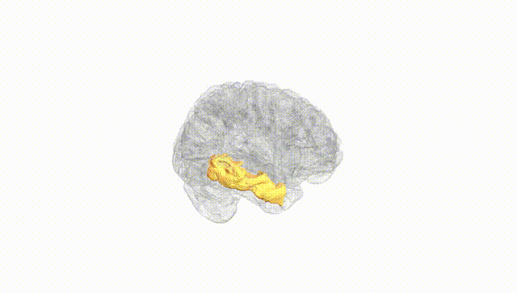
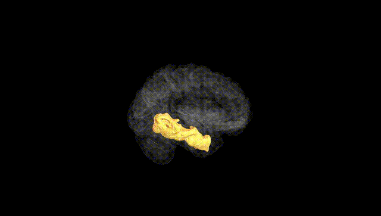
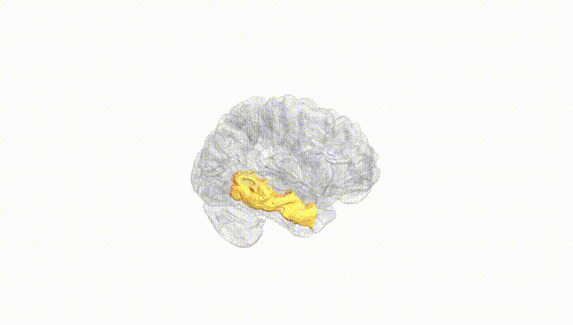
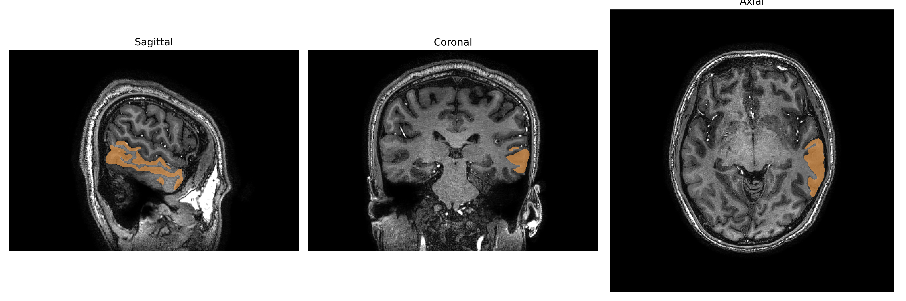
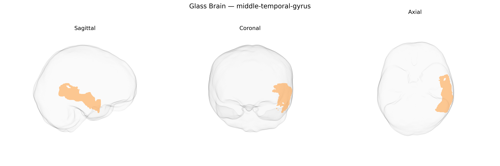

# middle-temporal-gyrus
 
## Overview
 
The left middle temporal gyrus is a lateral temporal lobe structure situated between the superior and inferior temporal gyri, extending from the temporal pole posteriorly toward the angular gyrus. Cytoarchitectonically, it encompasses portions of Brodmann areas 21 and 22 and participates in a distributed network for language comprehension, semantic processing, and higher-order auditory-visual integration. Functionally, this region contributes to lexical-semantic access, sentence-level processing, and the integration of conceptual knowledge, with left-hemispheric dominance particularly evident in speech and reading tasks. It is heavily interconnected with the superior temporal gyrus, inferior frontal gyrus (including Broca’s area), inferior parietal regions, and medial temporal structures, supporting multimodal association and long-range communication within the language and default-mode networks. Lesions in the left middle temporal gyrus are associated with receptive and transcortical sensory aphasia, semantic deficits, and impairments in narrative comprehension.  

[Middle temporal gyrus](https://en.wikipedia.org/wiki/Middle_temporal_gyrus)
 
The left middle temporal gyrus (MTG) in the brainCOLOR atlas corresponds to a lateral temporal cortical region repeatedly implicated in imaging genetics studies of cortical thickness, surface area, and functional activation, with several common variants showing regionally enriched effects. Large-scale GWAS of brain structure (e.g., ENIGMA, UK Biobank–based studies) have identified associations between left MTG morphology and loci near genes involved in neurodevelopment, synaptic function, and axonal guidance, including variants in or near MAPT, GRIN2A, DCC, and genes in Wnt and axon-growth pathways, although individual effect sizes are small and highly polygenic. Polygenic scores for schizophrenia, major depressive disorder, bipolar disorder, and autism spectrum disorder are associated with altered cortical thickness or surface area in the left MTG, paralleling case–control imaging findings of temporal lobe abnormalities in these conditions. GWAS of language-related traits (such as reading ability, phonological processing, and educational attainment) and of cognitive performance show correlations between implicated loci (e.g., near FOXP2-related networks, KIAA0319/DCDC2 for reading, and broad neurodevelopmental loci for intelligence) and structural or functional variation in the left MTG, consistent with its role in semantic and lexical processing. In Alzheimer’s disease and other dementias, risk variants in APOE and other AD-related genes are associated with atrophy patterns that prominently involve temporal cortices, including the left MTG, and GWAS of temporal lobe volume or temporal meta-ROIs also highlight loci related to tau, amyloid, and neuroinflammation pathways. Overall, the genetic architecture of the left MTG is highly polygenic and shared with other associative cortices, but converges on neurodevelopmental, synaptic, and neurodegenerative pathways that link this region to language, general cognition, and vulnerability to major psychiatric and neurodegenerative disorders.
 
*Overview generated by GPT-4o (2026).*
 
---
 
**Region ID:** 73  
**Hemisphere:** Left  
**Atlas:** brainCOLOR 
 
---
 
## middle-temporal-gyrus – Black Background (Full Brain)
 

 
**Full Quality Version:** <a href="full_black.mp4" download>Download MP4</a>
 
---
 
## middle-temporal-gyrus – White Background (Full Brain)
 

 
**Full Quality Version:** <a href="full_white.mp4" download>Download MP4</a>
 
---

## middle-temporal-gyrus – Black Background (Hemisphere)
 

 
**Full Quality Version:** <a href="hemi_black.mp4" download>Download MP4</a>
 
---
 
## middle-temporal-gyrus – White Background (Hemisphere)
 

 
**Full Quality Version:** <a href="hemi_white.mp4" download>Download MP4</a>
 
---

## Triplanar View – T1 Background
 

 
---
 
## Triplanar View – Ghost Brain
 


