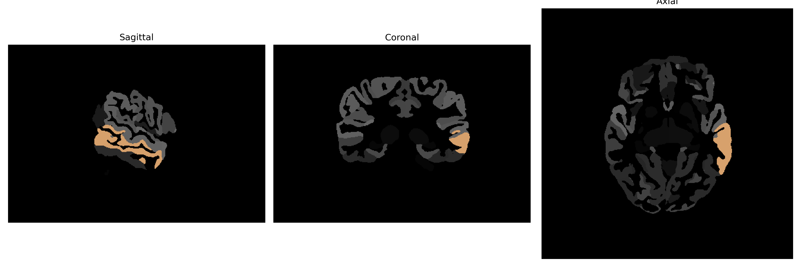

# middle-temporal-gyrus

## Overview

The left middle temporal gyrus is a region situated in the temporal lobe of the human brain, vital for various cognitive processes, including language comprehension, semantic memory, and auditory processing. Anatomically, it lies between the superior and inferior temporal gyri and is involved in the integration of sensory input and information processing. This gyrus plays a pivotal role in interpreting spoken and written language, facilitating complex linguistic tasks such as understanding grammar and constructing meaningful contexts. It connects with other areas of the brain, including the frontal and parietal lobes, through neural pathways that support higher-order cognitive functions and social cognition.

There is no direct Wikipedia link specifically for the left middle temporal gyrus. For related information, refer to the Wikipedia page on the temporal lobe: [https://en.wikipedia.org/wiki/Temporal_lobe](https://en.wikipedia.org/wiki/Temporal_lobe).

*Overview generated by GPT-4o (2026).*

---

**Region ID:** 73  
**Hemisphere:** Left  
**Atlas:** brainCOLOR 

---

## Full Brain – Black Background

**Full Quality Version:** [Download MP4](full_black.mp4)

---

## Full Brain – White Background

**Full Quality Version:** [Download MP4](full_white.mp4)

---

## Hemisphere Only – Black Background

**Full Quality Version:** [Download MP4](hemi_black.mp4)

---

## Hemisphere Only – White Background

**Full Quality Version:** [Download MP4](hemi_white.mp4)

---

## Triplanar View (Centered on ROI)

