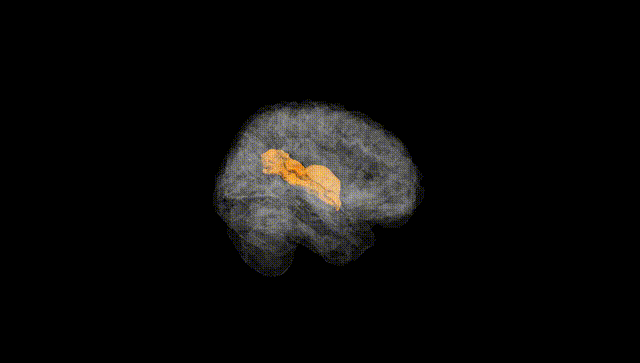
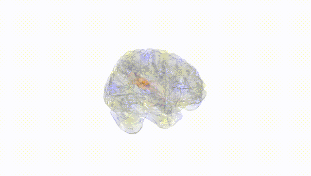
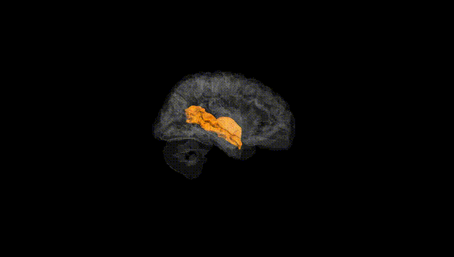
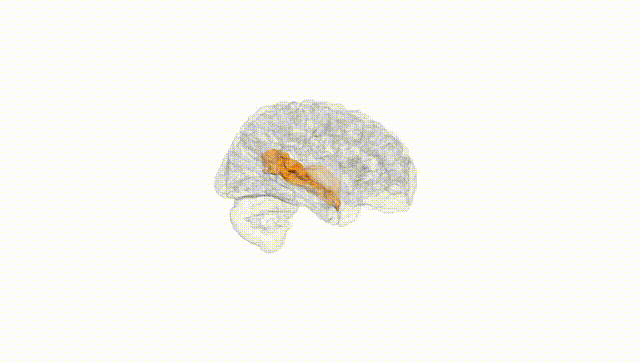
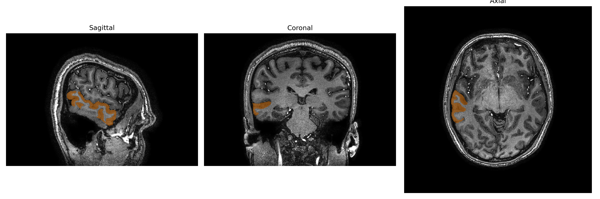
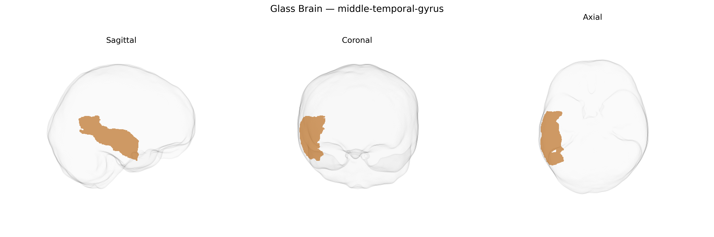

# middle-temporal-gyrus

## Overview

The right middle temporal gyrus (MTG) is a lateral temporal lobe region situated between the superior and inferior temporal gyri, extending rostrocaudally from the temporal pole toward the occipital lobe along the middle temporal sulcus. It is predominantly associated with higher-order auditory and language-related processes, semantic memory, and aspects of social cognition, including interpretation of biological motion and theory of mind, with the right hemisphere contributing especially to nonverbal, prosodic, and contextual aspects of communication. The MTG also participates in multimodal integration, interfacing visual and auditory inputs, and shows involvement in networks subserving attention, default-mode processing, and episodic memory retrieval. In the brainCOLOR Atlas, the “Right middle-temporal-gyrus” label refers to this anatomically defined cortical ribbon on the right temporal convexity, typically segmented based on gyral boundaries and sulcal landmarks. There is no direct Wikipedia page for the “Right middle-temporal-gyrus” as a hemisphere-specific label; a closely related and encompassing entry is the general “Middle temporal gyrus”: https://en.wikipedia.org/wiki/Middle_temporal_gyrus

*Overview generated by GPT-4o (2026).*

---

**Region ID:** 72  
**Hemisphere:** Right  
**Atlas:** brainCOLOR 

---

## middle-temporal-gyrus – Black Background (Full Brain)

**Full Quality Version:** [Download MP4](full_black.mp4)

---

## middle-temporal-gyrus – White Background (Full Brain)

**Full Quality Version:** [Download MP4](full_white.mp4)

---

## middle-temporal-gyrus – Black Background (Hemisphere)

**Full Quality Version:** [Download MP4](hemi_black.mp4)

---

## middle-temporal-gyrus – White Background (Hemisphere)

**Full Quality Version:** [Download MP4](hemi_white.mp4)

---

## Triplanar View – T1 Background

---

## Triplanar View – Ghost Brain


