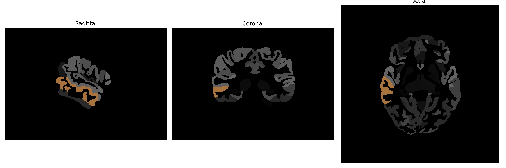

# middle-temporal-gyrus

## Overview

The right middle temporal gyrus is a region in the temporal lobe of the human brain involved in various cognitive functions, including language processing, semantic memory, and social cognition. It plays a critical role in the perception and interpretation of visual and auditory stimuli and is associated with the processing of complex linguistic information, such as understanding metaphors and sentences. The middle temporal gyrus, including its right hemisphere counterpart, is interconnected with various other brain regions, such as the prefrontal cortex, which aids in functions related to attention and working memory. Although there is no direct Wikipedia entry solely dedicated to the right middle temporal gyrus, it is part of the overarching structure of the temporal lobe, which can be explored further for additional context.

There is no direct link for the right middle temporal gyrus, but more information can be found under the temporal lobe: [https://en.wikipedia.org/wiki/Temporal_lobe](https://en.wikipedia.org/wiki/Temporal_lobe).

*Overview generated by GPT-4o (2026).*

---

**Region ID:** 72  
**Hemisphere:** Right  
**Atlas:** brainCOLOR 

---

## Full Brain – Black Background

**Full Quality Version:** [Download MP4](full_black.mp4)

---

## Full Brain – White Background

**Full Quality Version:** [Download MP4](full_white.mp4)

---

## Hemisphere Only – Black Background

**Full Quality Version:** [Download MP4](hemi_black.mp4)

---

## Hemisphere Only – White Background

**Full Quality Version:** [Download MP4](hemi_white.mp4)

---

## Triplanar View (Centered on ROI)

