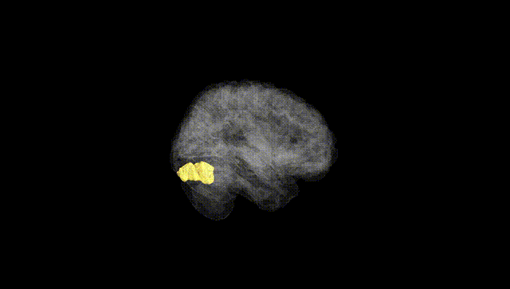
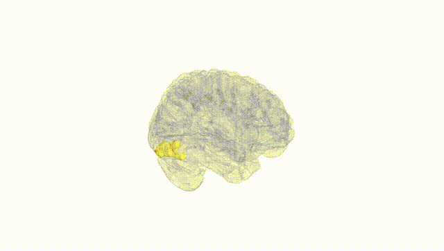
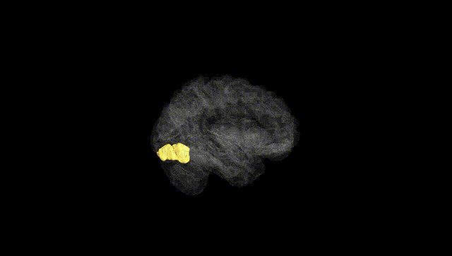
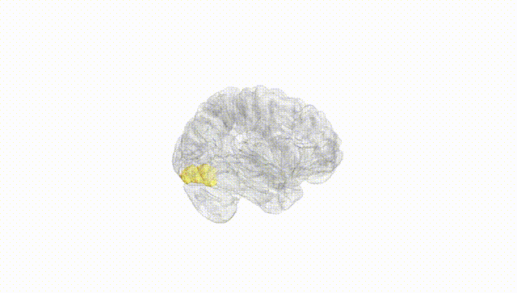
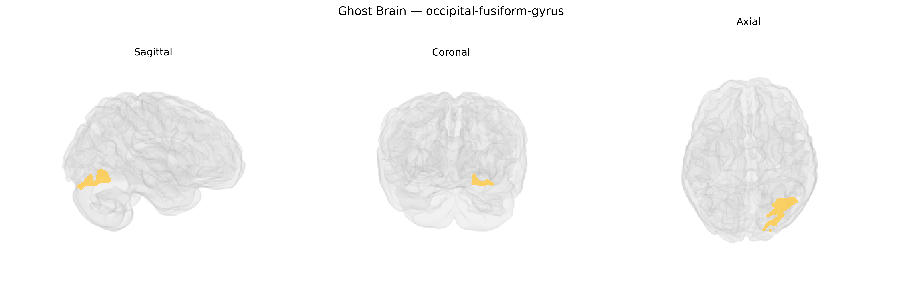

# occipital-fusiform-gyrus

## Overview

The left occipital-fusiform gyrus, as defined in the brainCOLOR atlas, corresponds to the posterior portion of the fusiform gyrus that extends into the occipital lobe and participates in high-level visual processing, including object and category recognition. Cytoarchitectonically, it lies within the ventral visual stream along the basal surface of the temporal and occipital lobes, bordered medially by the collateral sulcus and laterally by the inferior temporal gyrus. This region receives input from early visual areas (such as V1–V3) and relays increasingly complex visual information to anterior temporal and occipitotemporal regions implicated in semantic and perceptual integration. Functionally, it contributes to shape and form analysis, and subregions within the occipital-fusiform territory are associated with processing of faces, words, and other visually complex stimuli, although such functional subdivisions are not explicitly distinguished in the brainCOLOR atlas label. There is no direct Wikipedia entry for “left occipital-fusiform gyrus”; a closely related and encompassing structure is the fusiform gyrus: https://en.wikipedia.org/wiki/Fusiform_gyrus.

*Overview generated by GPT-4o (2026).*

---

**Region ID:** 77  
**Hemisphere:** Left  
**Atlas:** brainCOLOR 

---

## Full Brain – Black Background

**Full Quality Version:** [Download MP4](full_black.mp4)

---

## Full Brain – White Background

**Full Quality Version:** [Download MP4](full_white.mp4)

---

## Hemisphere Only – Black Background

**Full Quality Version:** [Download MP4](hemi_black.mp4)

---

## Hemisphere Only – White Background

**Full Quality Version:** [Download MP4](hemi_white.mp4)

---

## Triplanar View – T1 Background

---

## Triplanar View – Ghost Brain


