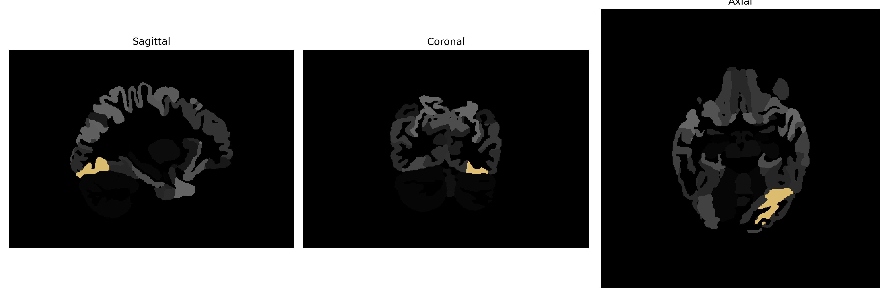

# occipital-fusiform-gyrus

## Overview

The Left occipital-fusiform gyrus, part of the human brain within the occipital lobe, serves as a critical region for processing visual information, particularly in object recognition and face perception. Located near the ventral surface of the occipital and temporal lobes, this region is associated with the integration of complex visual stimuli, playing a vital role in categorizing and identifying visual inputs efficiently. It interacts extensively with surrounding cortical regions, facilitating advanced visual processing necessary for tasks that require the discrimination of fine-grained details in the visual environment.

There is no direct Wikipedia link for the Left occipital-fusiform gyrus, but for further reading on the occipital lobe, which houses this gyrus, visit: https://en.wikipedia.org/wiki/Occipital_lobe

*Overview generated by GPT-4o (2026).*

---

**Region ID:** 77  
**Hemisphere:** Left  
**Atlas:** brainCOLOR 

---

## Full Brain – Black Background

**Full Quality Version:** [Download MP4](full_black.mp4)

---

## Full Brain – White Background

**Full Quality Version:** [Download MP4](full_white.mp4)

---

## Hemisphere Only – Black Background

**Full Quality Version:** [Download MP4](hemi_black.mp4)

---

## Hemisphere Only – White Background

**Full Quality Version:** [Download MP4](hemi_white.mp4)

---

## Triplanar View (Centered on ROI)

