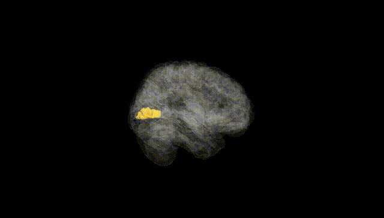
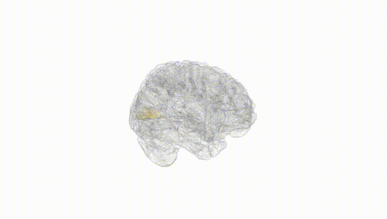
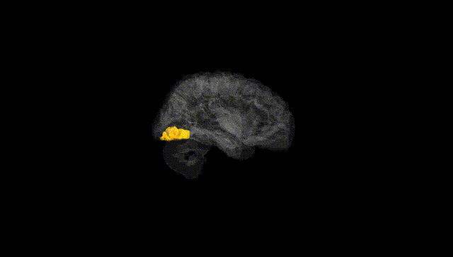
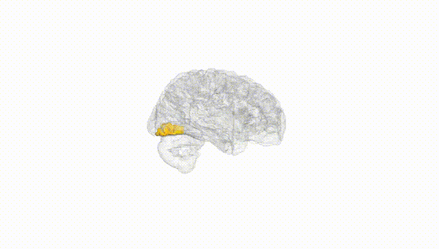
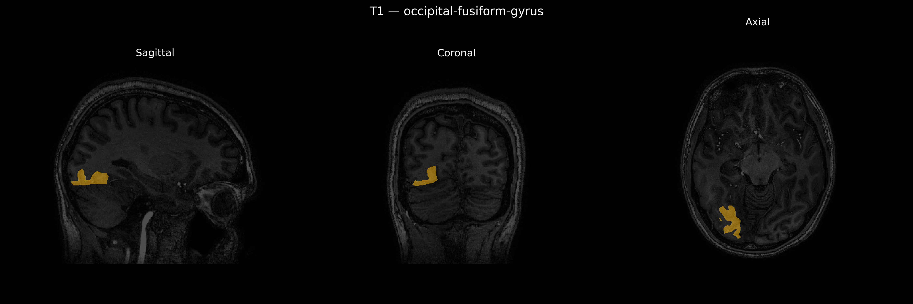
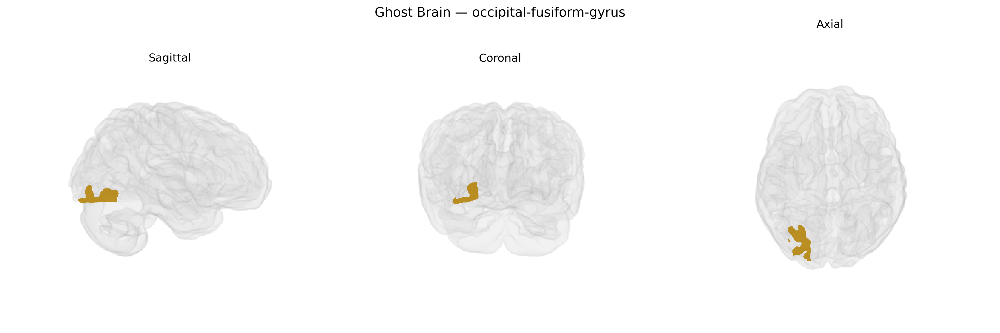

# occipital-fusiform-gyrus

## Overview

The right occipital-fusiform gyrus is a ventral temporal–occipital cortical region located on the inferior surface of the right hemisphere, spanning the junction between the occipital and temporal lobes and lying medial to the inferior temporal gyrus and lateral to the lingual gyrus and collateral sulcus. It is part of the ventral visual processing stream and is critically involved in high-level visual object processing, including aspects of face, word, and complex shape recognition, integrating detailed form information from earlier visual areas. Cytoarchitectonically, it corresponds largely to Brodmann area 37 and receives input from occipital visual cortices, relaying processed information to anterior temporal and frontal regions for semantic and associative processing. Damage to this region can contribute to deficits such as prosopagnosia or visual agnosia, depending on the extent and precise sub-regions affected. There is no direct Wikipedia page for the “right occipital-fusiform gyrus” from the brainCOLOR Atlas; a closely related and encompassing structure is the fusiform gyrus: https://en.wikipedia.org/wiki/Fusiform_gyrus

*Overview generated by GPT-4o (2026).*

---

**Region ID:** 76  
**Hemisphere:** Right  
**Atlas:** brainCOLOR 

---

## Full Brain – Black Background

**Full Quality Version:** [Download MP4](full_black.mp4)

---

## Full Brain – White Background

**Full Quality Version:** [Download MP4](full_white.mp4)

---

## Hemisphere Only – Black Background

**Full Quality Version:** [Download MP4](hemi_black.mp4)

---

## Hemisphere Only – White Background

**Full Quality Version:** [Download MP4](hemi_white.mp4)

---

## Triplanar View – T1 Background

---

## Triplanar View – Ghost Brain


