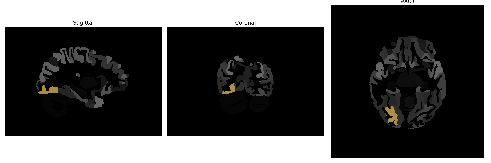

# occipital-fusiform-gyrus

## Overview

The Right Occipital-Fusiform Gyrus is a region of the brain located in the ventral part of the occipital lobe, extending into the fusiform gyrus area, which is largely situated in the temporal lobe. This gyrus plays a crucial role in visual processing, particularly in the recognition of complex stimuli such as faces and objects. It is part of the visual ventral pathway, also known as the "what pathway," which is involved in object identification and form recognition. The occipital-fusiform gyrus integrates sensory input with memory and emotional context, supporting the understanding and interpretation of visual information. 

There is no direct Wikipedia link for the "Right Occipital-Fusiform Gyrus." However, a related article that covers part of its function and location is about the "Fusiform Gyrus" which can be found here: https://en.wikipedia.org/wiki/Fusiform_gyrus.

*Overview generated by GPT-4o (2026).*

---

**Region ID:** 76  
**Hemisphere:** Right  
**Atlas:** brainCOLOR 

---

## Full Brain – Black Background

**Full Quality Version:** [Download MP4](full_black.mp4)

---

## Full Brain – White Background

**Full Quality Version:** [Download MP4](full_white.mp4)

---

## Hemisphere Only – Black Background

**Full Quality Version:** [Download MP4](hemi_black.mp4)

---

## Hemisphere Only – White Background

**Full Quality Version:** [Download MP4](hemi_white.mp4)

---

## Triplanar View (Centered on ROI)

