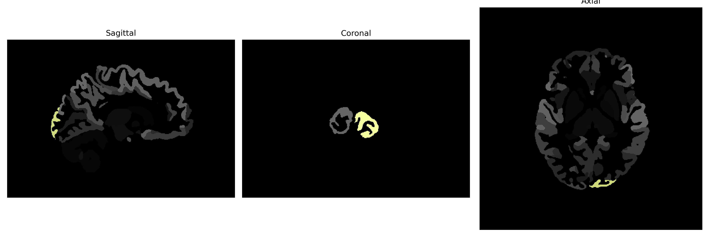

# occipital-pole

## Overview

The Left occipital-pole brain region is an integral part of the occipital lobe located at the posterior section of the cerebral cortex. This area is primarily involved in the processing of visual information, where it plays a significant role in interpreting incoming visual cues from the eyes, aiding in visual recognition and spatial awareness. As the terminal point of the visual pathways, it is essential for visual perception, contributing to complex tasks such as reading and identifying objects. Structurally, it is defined by its dense neuronal connections to the primary visual cortex and other specialized visual cortices within the occipital lobe. Its involvement in higher-order visual processing makes it a critical region in the overall functioning of the visual system.

There is no direct link to a Wikipedia page specifically for the Left occipital-pole brain region. However, a related area, the [Occipital lobe](https://en.wikipedia.org/wiki/Occipital_lobe), can be explored for further information.

*Overview generated by GPT-4o (2026).*

---

**Region ID:** 75  
**Hemisphere:** Left  
**Atlas:** brainCOLOR 

---

## Full Brain – Black Background

**Full Quality Version:** [Download MP4](full_black.mp4)

---

## Full Brain – White Background

**Full Quality Version:** [Download MP4](full_white.mp4)

---

## Hemisphere Only – Black Background

**Full Quality Version:** [Download MP4](hemi_black.mp4)

---

## Hemisphere Only – White Background

**Full Quality Version:** [Download MP4](hemi_white.mp4)

---

## Triplanar View (Centered on ROI)

