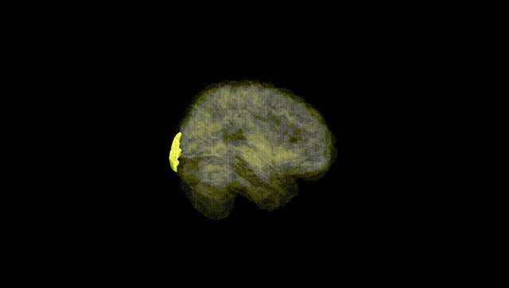
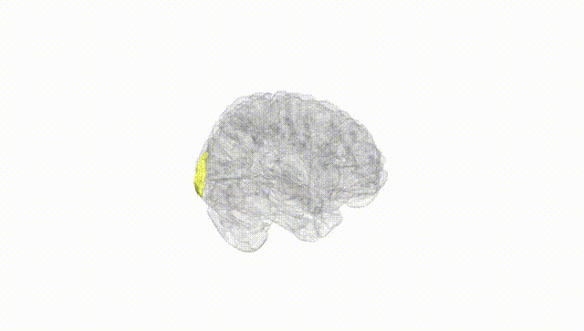
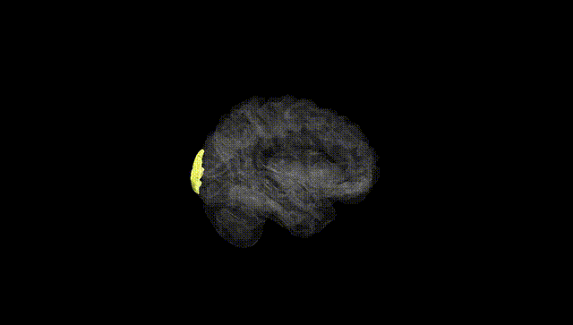
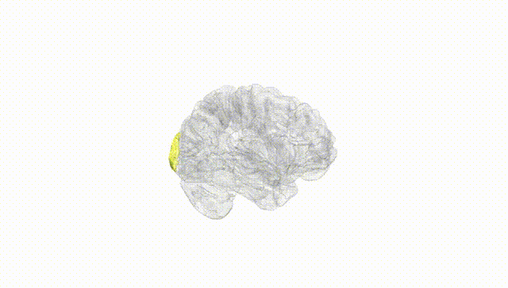
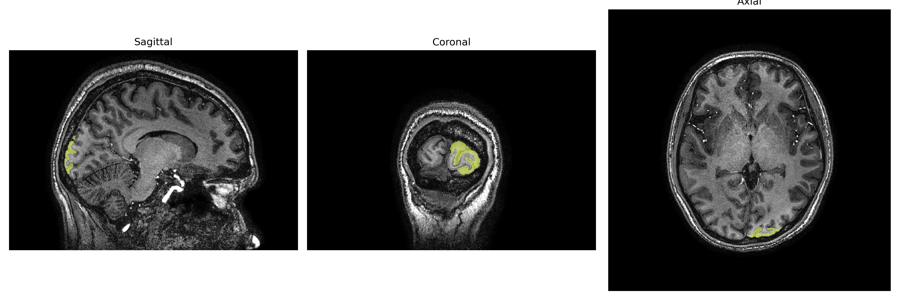
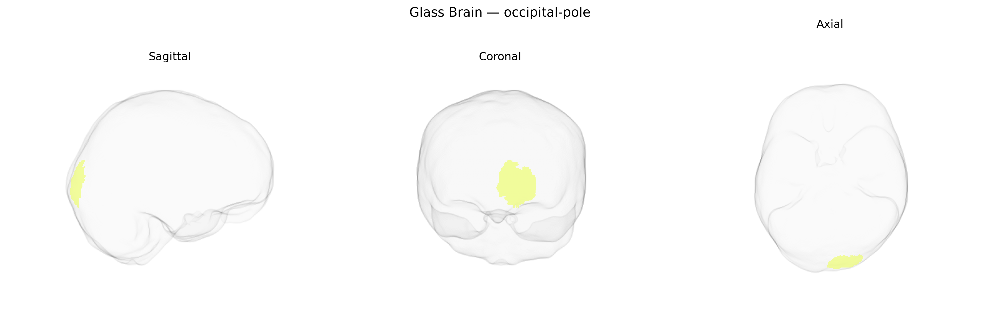

# occipital-pole

## Overview

The left occipital pole is the most posterior portion of the left occipital lobe, corresponding largely to the cortical representation of the central visual field within the primary visual cortex (V1, Brodmann area 17) and adjacent early visual areas (V2/V3). It receives dense input from the lateral geniculate nucleus of the thalamus via the optic radiations and is organized retinotopically, with a fine-grained mapping of foveal and parafoveal regions that supports high-acuity visual processing, edge and contrast detection, and basic feature encoding of visual stimuli. Functionally, the left occipital pole contributes to the initial stages of visual perception that underlie object recognition, reading, and visually guided behaviors, and its activity is tightly integrated with higher-order visual areas along ventral and dorsal visual processing streams. There is no direct Wikipedia entry for the “left occipital pole” as a standalone region; a closely related structure and context is described here: https://en.wikipedia.org/wiki/Occipital_lobe

*Overview generated by GPT-4o (2026).*

---

**Region ID:** 75  
**Hemisphere:** Left  
**Atlas:** brainCOLOR 

---

## occipital-pole – Black Background (Full Brain)

**Full Quality Version:** [Download MP4](full_black.mp4)

---

## occipital-pole – White Background (Full Brain)

**Full Quality Version:** [Download MP4](full_white.mp4)

---

## occipital-pole – Black Background (Hemisphere)

**Full Quality Version:** [Download MP4](hemi_black.mp4)

---

## occipital-pole – White Background (Hemisphere)

**Full Quality Version:** [Download MP4](hemi_white.mp4)

---

## Triplanar View – T1 Background

---

## Triplanar View – Ghost Brain


