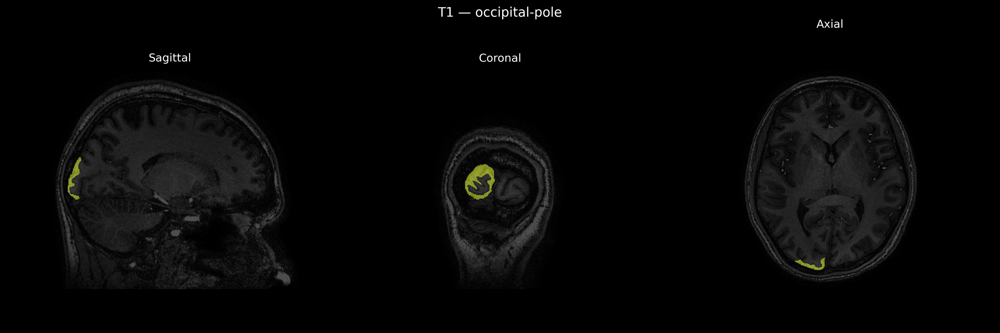
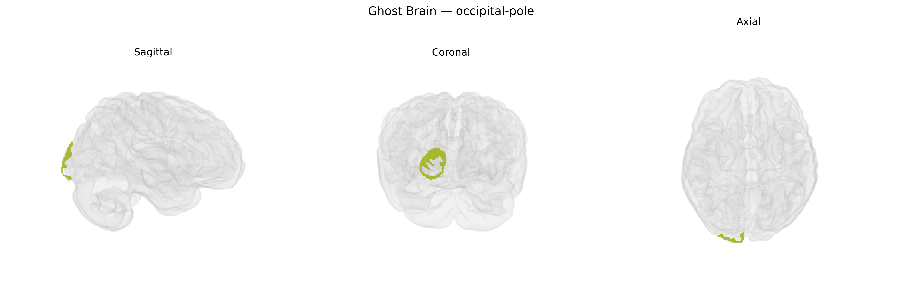

# occipital-pole
 
## Overview
 
The right occipital pole is the most posterior portion of the right occipital lobe and encompasses the cortical territory surrounding the occipital apex, including early visual processing areas near or within the primary visual cortex (V1). This region is predominantly involved in processing central visual field information and contributes to basic visual feature analysis such as orientation, contrast, and spatial frequency, which are then relayed to higher-order visual areas along dorsal and ventral visual streams. Functionally, the right occipital pole participates in the initial stages of visual perception that support object recognition, spatial localization, and motion perception, and lesions in this region can produce contralateral visual field deficits, particularly affecting central vision. In the brainCOLOR Atlas, the right occipital pole is delineated as a distinct cortical parcel based on anatomical landmarks and imaging-based parcellation schemes within the broader occipital lobe. [Occipital lobe](https://en.wikipedia.org/wiki/Occipital_lobe)
 
The right occipital pole, corresponding to primary and early visual cortex in the brainCOLOR atlas, shows genetic influences that largely reflect general visual system and cortical structure organization rather than a region-specific set of loci. Large imaging–genetics consortia (e.g., ENIGMA, UK Biobank) have identified multiple SNPs and genes associated with occipital cortical surface area and thickness, including variants near genes involved in neurodevelopment, axon guidance, and synaptic signaling (such as those in pathways related to Wnt signaling and neuronal migration), though findings are typically reported for broader occipital or visual cortical regions rather than the right occipital pole specifically. Polygenic scores for educational attainment, intelligence, and general cognitive ability show modest associations with occipital cortical metrics, reflecting shared genetic architecture for brain size and cognition. Occipital structural and functional measures, including within the right occipital pole, have also been implicated in GWAS of disorders with prominent visual or visuo-perceptual components, including migraine, schizophrenia, autism spectrum disorder, and major depression, but these associations are generally indirect (e.g., via global cortical measures or distributed networks) rather than uniquely localized to this parcel. Overall, current genetic evidence supports substantial heritability and polygenic influence on right occipital pole anatomy and function, but no highly specific, well-replicated gene set is uniquely tied to this precise brainCOLOR-defined region.
 
*Overview generated by GPT-4o (2026).*
 
---
 
**Region ID:** 74  
**Hemisphere:** Right  
**Atlas:** brainCOLOR 
 
---
 
## occipital-pole – Black Background (Full Brain)
 

 
**Full Quality Version:** <a href="full_black.mp4" download>Download MP4</a>
 
---
 
## occipital-pole – White Background (Full Brain)
 

 
**Full Quality Version:** <a href="full_white.mp4" download>Download MP4</a>
 
---

## occipital-pole – Black Background (Hemisphere)
 

 
**Full Quality Version:** <a href="hemi_black.mp4" download>Download MP4</a>
 
---
 
## occipital-pole – White Background (Hemisphere)
 

 
**Full Quality Version:** <a href="hemi_white.mp4" download>Download MP4</a>
 
---

## Triplanar View – T1 Background
 

 
---
 
## Triplanar View – Ghost Brain
 


