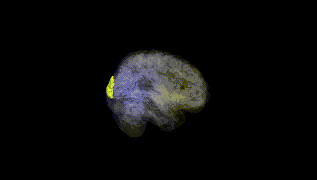
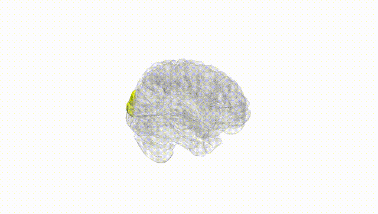
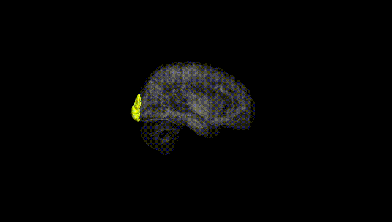
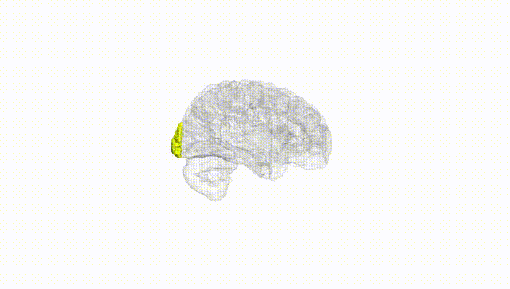
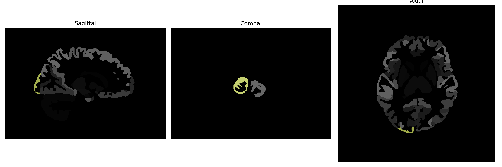

# occipital-pole

## Overview

The right occipital-pole is a region located at the posterior aspect of the occipital lobe, which comprises the most caudal region of the cerebral cortex. It is primarily involved in the processing of visual information, acting as a center for receiving and interpreting visual stimuli. This region of the brain is crucial for visual perception, helping to process complex visual cues such as color, motion, and spatial orientation. The right occipital-pole is also significant in integrating visual information from the retinas through the visual pathways and contributing to higher-level cognitive functions related to vision, including facial recognition and object identification.

There is no direct Wikipedia link to a specific "Right occipital-pole" description from the brainCOLOR Atlas. However, a related area is the Occipital lobe, which can be explored here: [https://en.wikipedia.org/wiki/Occipital_lobe](https://en.wikipedia.org/wiki/Occipital_lobe).

*Overview generated by GPT-4o (2026).*

---

**Region ID:** 74  
**Hemisphere:** Right  
**Atlas:** brainCOLOR 

---

## Full Brain – Black Background

**Full Quality Version:** [Download MP4](full_black.mp4)

---

## Full Brain – White Background

**Full Quality Version:** [Download MP4](full_white.mp4)

---

## Hemisphere Only – Black Background

**Full Quality Version:** [Download MP4](hemi_black.mp4)

---

## Hemisphere Only – White Background

**Full Quality Version:** [Download MP4](hemi_white.mp4)

---

## Triplanar View (Centered on ROI)

