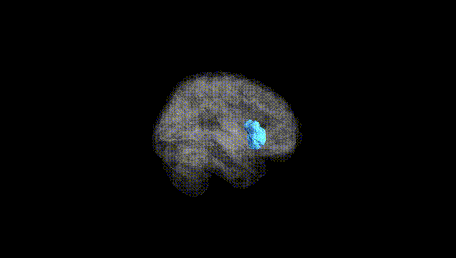
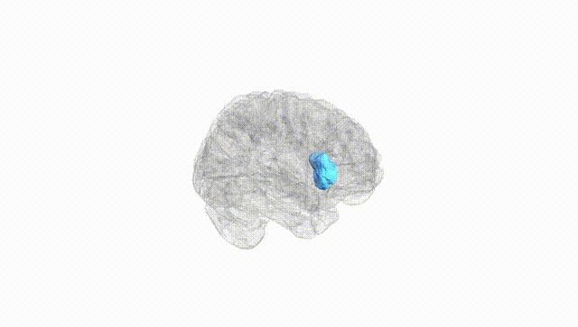
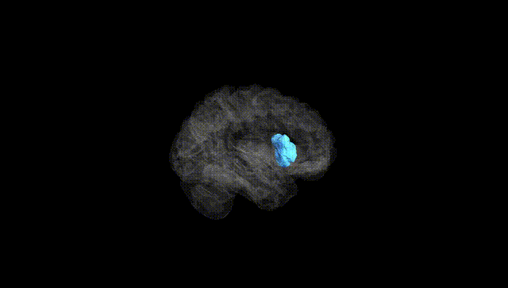
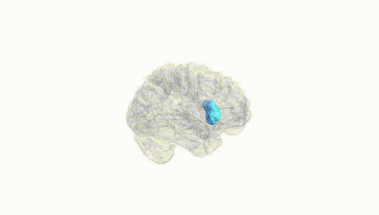
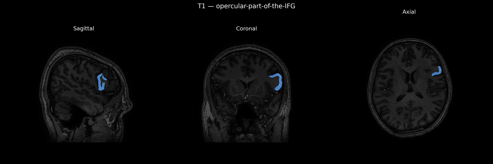
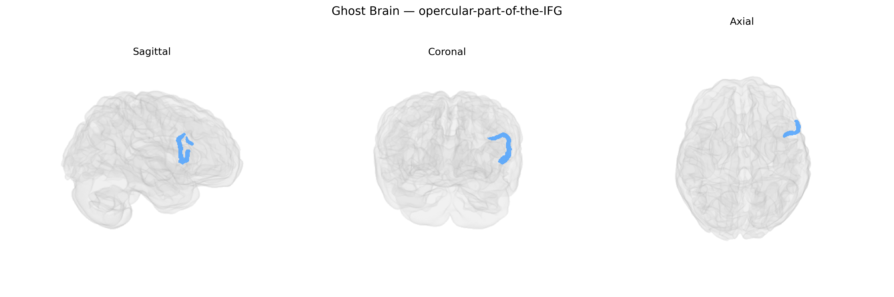

# opercular-part-of-the-IFG

## Overview

The left opercular part of the inferior frontal gyrus (IFG), corresponding roughly to Brodmann area 44, is a posterior subdivision of the IFG located in the frontal lobe of the left hemisphere, bordered dorsally by the precentral gyrus and anteriorly by the triangular part of the IFG. It overlies the anterior insula and forms part of the frontal operculum, contributing to the ventral premotor and language networks. This region is heavily implicated in phonological processing, speech production, and syntactic operations, and is often considered a core component of Broca’s area. Cytoarchitectonically, it is characterized by a granular frontal cortex with distinct pyramidal cell layers that support complex motor planning and hierarchical sequencing of articulatory movements. Vascular supply arises mainly from branches of the middle cerebral artery, and it maintains dense connections with superior temporal and parietal language-related cortices as well as subcortical structures involved in motor control.

There is no direct Wikipedia link specifically for the “Left opercular-part-of-the-IFG” as labeled in the brainCOLOR Atlas; a closely related and encompassing structure is the inferior frontal gyrus: https://en.wikipedia.org/wiki/Inferior_frontal_gyrus

*Overview generated by GPT-4o (2026).*

---

**Region ID:** 79  
**Hemisphere:** Left  
**Atlas:** brainCOLOR 

---

## Full Brain – Black Background

**Full Quality Version:** [Download MP4](full_black.mp4)

---

## Full Brain – White Background

**Full Quality Version:** [Download MP4](full_white.mp4)

---

## Hemisphere Only – Black Background

**Full Quality Version:** [Download MP4](hemi_black.mp4)

---

## Hemisphere Only – White Background

**Full Quality Version:** [Download MP4](hemi_white.mp4)

---

## Triplanar View – T1 Background

---

## Triplanar View – Ghost Brain


