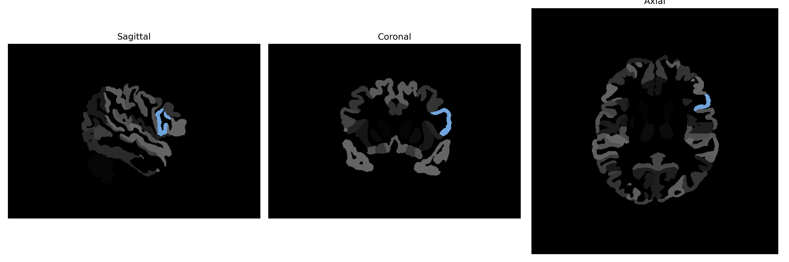

# opercular-part-of-the-IFG

## Overview

The Left opercular-part-of-the-IFG, part of the inferior frontal gyrus (IFG) in the human brain, is integral to language processing and production. This region, located in the frontal lobe's dominant hemisphere, plays a crucial role in the motor aspects of speech. It is involved in complex cognitive functions such as language comprehension, syntax, and phonological processing. The opercular part is distinguished by its role in coordinating the perceptual and motor functions necessary for speech production, linking it closely to Broca's area, which is key in language and speech processes. Anatomically, the IFG is bordered inferiorly by the lateral sulcus and is composed of three parts: the pars opercularis, pars triangularis, and pars orbitalis, each contributing uniquely to language and executive functions.

There is no direct Wikipedia link specifically for the Left opercular-part-of-the-IFG from the brainCOLOR Atlas. A related link is: https://en.wikipedia.org/wiki/Inferior_frontal_gyrus.

*Overview generated by GPT-4o (2026).*

---

**Region ID:** 79  
**Hemisphere:** Left  
**Atlas:** brainCOLOR 

---

## Full Brain – Black Background

**Full Quality Version:** [Download MP4](full_black.mp4)

---

## Full Brain – White Background

**Full Quality Version:** [Download MP4](full_white.mp4)

---

## Hemisphere Only – Black Background

**Full Quality Version:** [Download MP4](hemi_black.mp4)

---

## Hemisphere Only – White Background

**Full Quality Version:** [Download MP4](hemi_white.mp4)

---

## Triplanar View (Centered on ROI)

