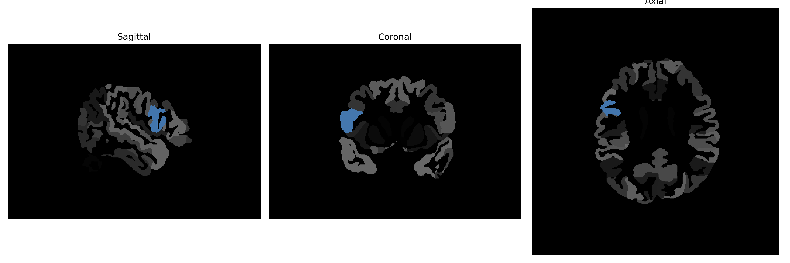

# opercular-part-of-the-IFG

## Overview

The Right opercular-part-of-the-Inferior Frontal Gyrus (IFG) is a subdivision of the broader right inferior frontal gyrus, characterized by its involvement in language processing and speech production. Situated in the frontal lobe of the brain, this region contributes to phonological and syntactic aspects of language. It is part of the network that assists in motor control functions related to speech, emphasizing its significance in the articulation and fluency of verbal communication. In addition to linguistic roles, the opercular part plays a role in cognitive processes such as attention and executive functions.

There is no direct link to this specific description on Wikipedia. However, a related area is the Inferior Frontal Gyrus, for which the Wikipedia link is: https://en.wikipedia.org/wiki/Inferior_frontal_gyrus

*Overview generated by GPT-4o (2026).*

---

**Region ID:** 78  
**Hemisphere:** Right  
**Atlas:** brainCOLOR 

---

## Full Brain – Black Background

**Full Quality Version:** [Download MP4](full_black.mp4)

---

## Full Brain – White Background

**Full Quality Version:** [Download MP4](full_white.mp4)

---

## Hemisphere Only – Black Background

**Full Quality Version:** [Download MP4](hemi_black.mp4)

---

## Hemisphere Only – White Background

**Full Quality Version:** [Download MP4](hemi_white.mp4)

---

## Triplanar View (Centered on ROI)

