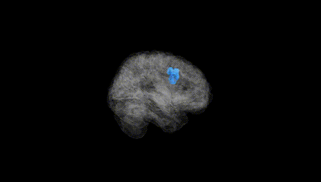
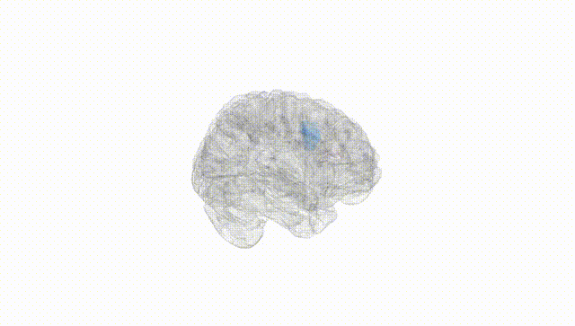
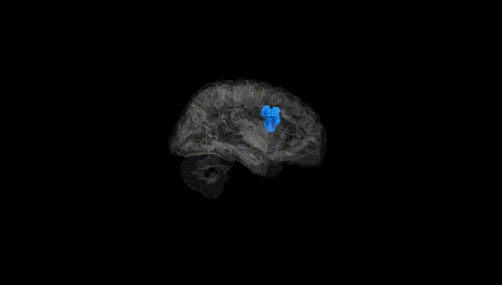
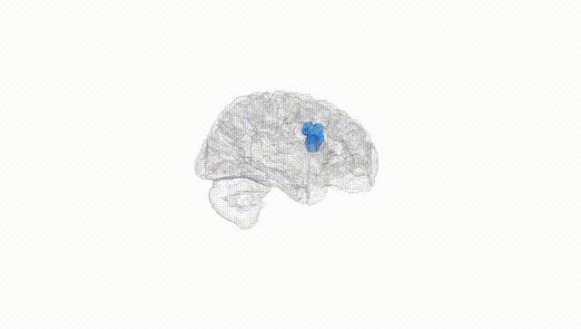
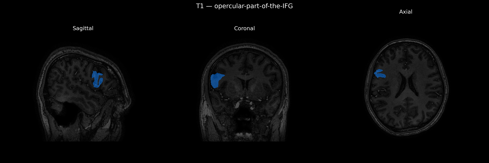
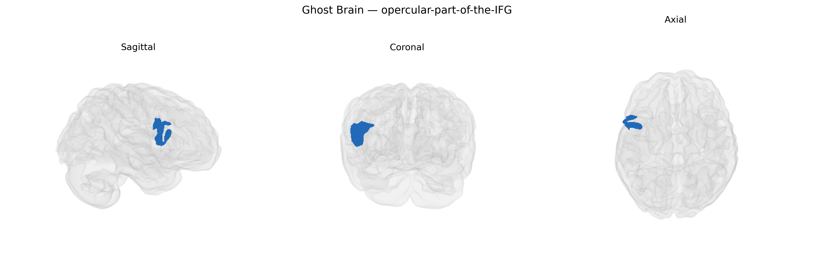

# opercular-part-of-the-IFG
 
## Overview
 
The right opercular part of the inferior frontal gyrus (right opercular-part-of-the-IFG) is a subdivision of the inferior frontal gyrus located in the posterior frontal lobe, overlying the insula and bordering the lateral sulcus. Cytoarchitectonically, it corresponds largely to Brodmann area 44, forming part of the ventrolateral prefrontal cortex. This region is implicated in phonological and articulatory aspects of speech, sensorimotor integration for orofacial movements, and aspects of response inhibition and cognitive control. It is densely interconnected with premotor and primary motor cortices, the superior temporal gyrus, parietal regions, and subcortical structures such as the basal ganglia. In the right hemisphere, it is additionally associated with prosody, emotional intonation, and certain nonverbal communicative and executive functions. There is no direct Wikipedia article for this exact subdivision; see the related area [Inferior frontal gyrus](https://en.wikipedia.org/wiki/Inferior_frontal_gyrus).
 
The right opercular part of the inferior frontal gyrus (IFG), corresponding roughly to pars opercularis and often implicated in speech articulation, phonological processing, and response inhibition, appears in several imaging–genetics and GWAS-based brain morphology studies, although usually under broader IFG or right frontal opercular labels rather than the specific brainCOLOR atlas parcel. Variants near genes involved in neurodevelopment and synaptic function (for example, FOXP2, CNTNAP2, DCDC2, KIAA0319) have been linked to language-related activation and structure in this territory, particularly in tasks involving speech production or phonological processing, and in disorders such as developmental language disorder and dyslexia, though these effects are generally distributed across a fronto-temporo-parietal network rather than confined solely to the right opercular IFG. Large-scale GWAS of cortical surface area and thickness (e.g., ENIGMA, UK Biobank–based analyses) have identified SNPs associated with structural variation in inferior frontal and opercular regions—often involving genes related to neuronal migration, axon guidance, and synaptic plasticity—but these findings typically refer to bilateral or right inferior frontal regions without isolating the opercular subdivision. Functionally, right IFG/opercular regions are frequently implicated in response inhibition and impulse control, and polygenic risk for ADHD and other externalizing disorders shows distributed associations with activation and morphology in right IFG networks, though again not consistently parcel-specific. Overall, genetic associations with the right opercular-part-of-the-IFG are currently indirect and regionally coarse, emerging mainly from broader IFG or frontal opercular GWAS of brain structure and function, and from candidate-gene and polygenic studies of language, executive control, and related neurodevelopmental disorders, rather than from locus-specific GWAS targeting this particular brainCOLOR-defined region.
 
*Overview generated by GPT-4o (2026).*
 
---
 
**Region ID:** 78  
**Hemisphere:** Right  
**Atlas:** brainCOLOR 
 
---
 
## opercular-part-of-the-IFG – Black Background (Full Brain)
 

 
**Full Quality Version:** <a href="full_black.mp4" download>Download MP4</a>
 
---
 
## opercular-part-of-the-IFG – White Background (Full Brain)
 

 
**Full Quality Version:** <a href="full_white.mp4" download>Download MP4</a>
 
---

## opercular-part-of-the-IFG – Black Background (Hemisphere)
 

 
**Full Quality Version:** <a href="hemi_black.mp4" download>Download MP4</a>
 
---
 
## opercular-part-of-the-IFG – White Background (Hemisphere)
 

 
**Full Quality Version:** <a href="hemi_white.mp4" download>Download MP4</a>
 
---

## Triplanar View – T1 Background
 

 
---
 
## Triplanar View – Ghost Brain
 


