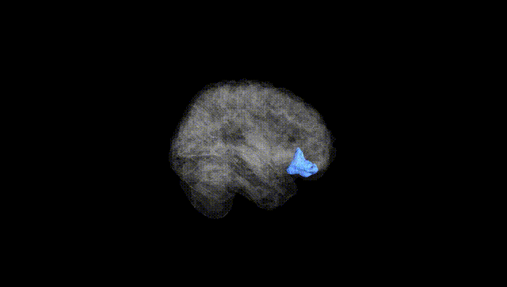
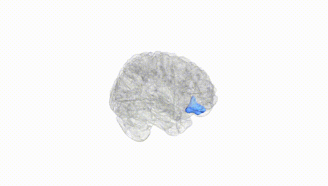
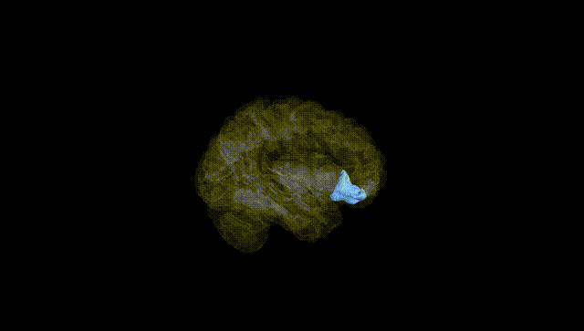
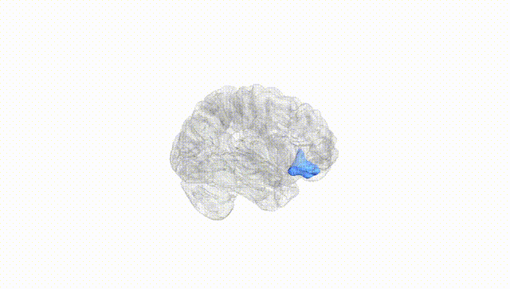
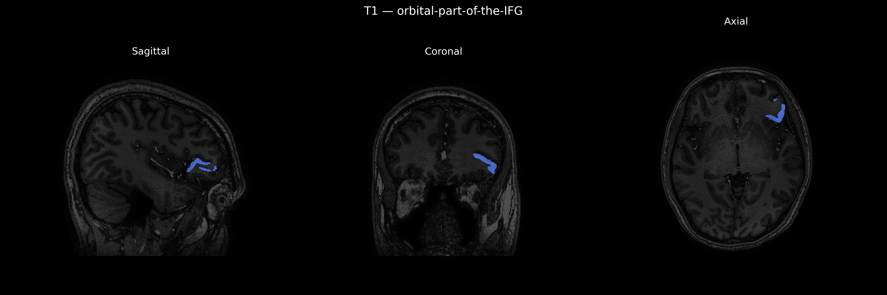
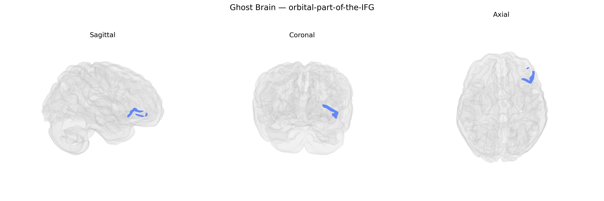

# orbital-part-of-the-IFG

## Overview

The left orbital part of the inferior frontal gyrus (IFGorb_L), as defined in the brainCOLOR Atlas, is a cortical subdivision of the inferior frontal gyrus located on the ventral (orbital) surface of the frontal lobe, overlying the orbital plate of the frontal bone and situated anterior to the insula and lateral to the gyrus rectus and medial orbital cortex. Cytoarchitectonically, this region corresponds largely to portions of Brodmann areas 47/12 and possibly ventral 45, characterized by a granular prefrontal cortex with dense reciprocal connections to limbic, paralimbic, and multimodal association areas, including the orbitofrontal cortex, anterior temporal lobe, and amygdala. Functionally, the left orbital IFG is implicated in higher-order cognitive and affective processes such as reward-based decision making, evaluation of stimulus valence, response inhibition, and in the left hemisphere may contribute to aspects of language processing, particularly semantic selection and controlled retrieval. There is no direct Wikipedia page for the “left orbital-part-of-the-IFG” as defined in the brainCOLOR Atlas; a closely related and encompassing structure is the *inferior frontal gyrus*: https://en.wikipedia.org/wiki/Inferior_frontal_gyrus.

*Overview generated by GPT-4o (2026).*

---

**Region ID:** 81  
**Hemisphere:** Left  
**Atlas:** brainCOLOR 

---

## Full Brain – Black Background

**Full Quality Version:** [Download MP4](full_black.mp4)

---

## Full Brain – White Background

**Full Quality Version:** [Download MP4](full_white.mp4)

---

## Hemisphere Only – Black Background

**Full Quality Version:** [Download MP4](hemi_black.mp4)

---

## Hemisphere Only – White Background

**Full Quality Version:** [Download MP4](hemi_white.mp4)

---

## Triplanar View – T1 Background

---

## Triplanar View – Ghost Brain


