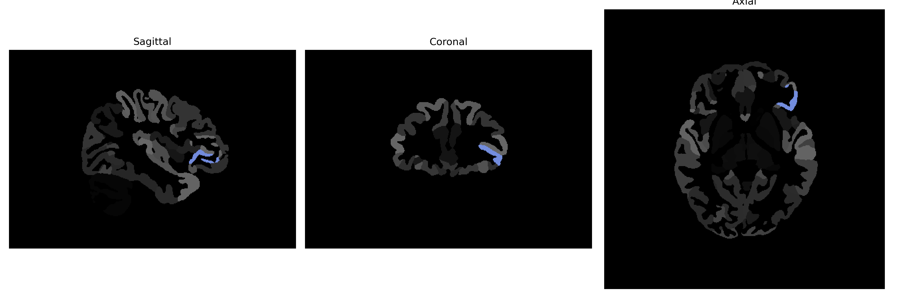

# orbital-part-of-the-IFG

## Overview

The Left orbital-part-of-the-Inferior Frontal Gyrus (IFG) is a specific region within the prefrontal cortex of the brain, identified in the brainCOLOR Atlas. This area is situated on the left side of the brain and is part of the orbital frontal cortex, which lies above the orbit of the eye. It plays a crucial role in various functions such as language processing, decision-making, and managing social behavior. The IFG is heavily involved in the implementation of higher cognitive processes and is associated with speech production and comprehension. Its connectivity with other brain regions supports its involvement in complex behaviors and executive functions.

There is no direct Wikipedia link to the Left orbital-part-of-the-IFG specifically as described in the brainCOLOR Atlas. However, a related page is the general entry for the Inferior Frontal Gyrus: https://en.wikipedia.org/wiki/Inferior_frontal_gyrus.

*Overview generated by GPT-4o (2026).*

---

**Region ID:** 81  
**Hemisphere:** Left  
**Atlas:** brainCOLOR 

---

## Full Brain – Black Background

**Full Quality Version:** [Download MP4](full_black.mp4)

---

## Full Brain – White Background

**Full Quality Version:** [Download MP4](full_white.mp4)

---

## Hemisphere Only – Black Background

**Full Quality Version:** [Download MP4](hemi_black.mp4)

---

## Hemisphere Only – White Background

**Full Quality Version:** [Download MP4](hemi_white.mp4)

---

## Triplanar View (Centered on ROI)

