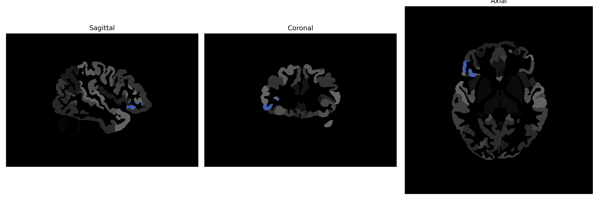

# orbital-part-of-the-IFG

## Overview

The Right orbital-part-of-the-Inferior Frontal Gyrus (IFG) is a brain region situated in the frontal lobe, specifically part of the prefrontal cortex. This region is associated with various cognitive functions, including aspects of language processing, emotional regulation, and decision-making. The orbital part of the IFG integrates sensory information with emotional and social cues, playing a crucial role in adaptive behaviors and personality traits. Anatomically, it lies anteriorly and is bordered by the frontal pole and the anterior insula. This area is involved in the complex networks that underpin social cognition and executive functioning.

There is no direct Wikipedia link specifically for the Right orbital-part-of-the-Inferior Frontal Gyrus. However, for more information on a related structure, refer to the [Inferior Frontal Gyrus](https://en.wikipedia.org/wiki/Inferior_frontal_gyrus) page on Wikipedia.

*Overview generated by GPT-4o (2026).*

---

**Region ID:** 80  
**Hemisphere:** Right  
**Atlas:** brainCOLOR 

---

## Full Brain – Black Background

**Full Quality Version:** [Download MP4](full_black.mp4)

---

## Full Brain – White Background

**Full Quality Version:** [Download MP4](full_white.mp4)

---

## Hemisphere Only – Black Background

**Full Quality Version:** [Download MP4](hemi_black.mp4)

---

## Hemisphere Only – White Background

**Full Quality Version:** [Download MP4](hemi_white.mp4)

---

## Triplanar View (Centered on ROI)

