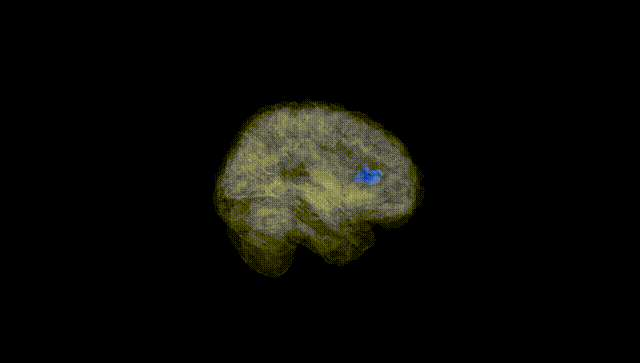
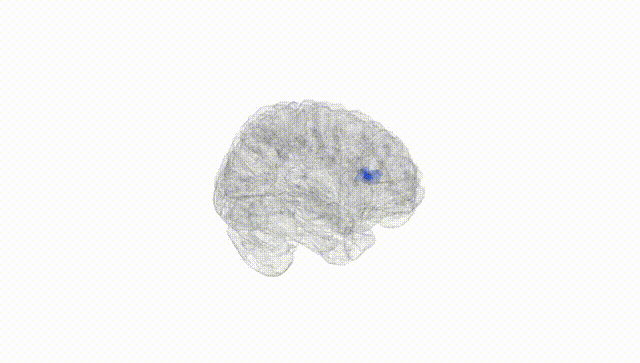
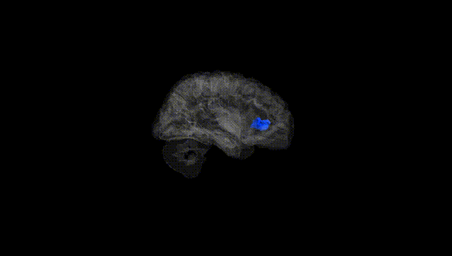
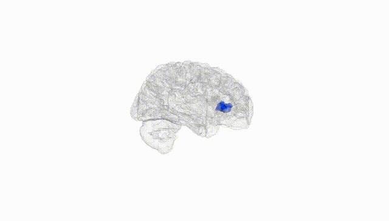
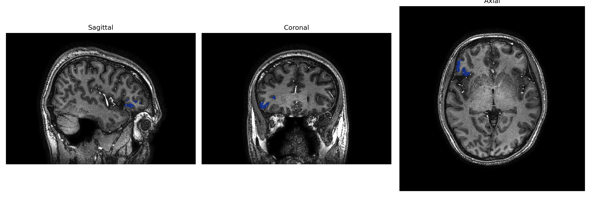
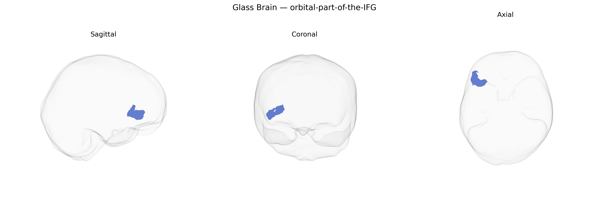

# orbital-part-of-the-IFG

## Overview

The right orbital part of the inferior frontal gyrus (right orbital-part-of-the-IFG) is a ventral prefrontal cortical region located on the orbital surface of the frontal lobe, corresponding largely to the orbital subdivision of Brodmann area 47 (and parts of 11/12 in some schemes). It is situated inferior to the middle frontal gyrus and anterior to the insula, forming part of the orbitofrontal cortex that overlies the anterior cranial fossa. Cytoarchitectonically, this area shows granular prefrontal cortex features, with dense reciprocal connections to limbic regions (including amygdala and hippocampal formation), temporal association cortex, and other prefrontal territories. Functionally, the right orbital IFG is implicated in reward valuation, affective decision-making, social and emotional processing, and aspects of inhibitory control, particularly in the context of emotionally salient or reward-related stimuli. In human neuroimaging, this region is frequently activated during tasks involving evaluation of outcomes, moral and social judgments, and reappraisal of emotional information.

There is no direct Wikipedia page for “Right orbital-part-of-the-IFG” as defined in the brainCOLOR Atlas; a closely related and encompassing structure is the inferior frontal gyrus: https://en.wikipedia.org/wiki/Inferior_frontal_gyrus

*Overview generated by GPT-4o (2026).*

---

**Region ID:** 80  
**Hemisphere:** Right  
**Atlas:** brainCOLOR 

---

## orbital-part-of-the-IFG – Black Background (Full Brain)

**Full Quality Version:** [Download MP4](full_black.mp4)

---

## orbital-part-of-the-IFG – White Background (Full Brain)

**Full Quality Version:** [Download MP4](full_white.mp4)

---

## orbital-part-of-the-IFG – Black Background (Hemisphere)

**Full Quality Version:** [Download MP4](hemi_black.mp4)

---

## orbital-part-of-the-IFG – White Background (Hemisphere)

**Full Quality Version:** [Download MP4](hemi_white.mp4)

---

## Triplanar View – T1 Background

---

## Triplanar View – Ghost Brain


