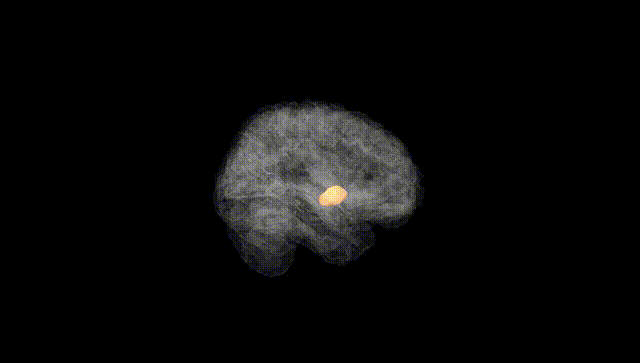
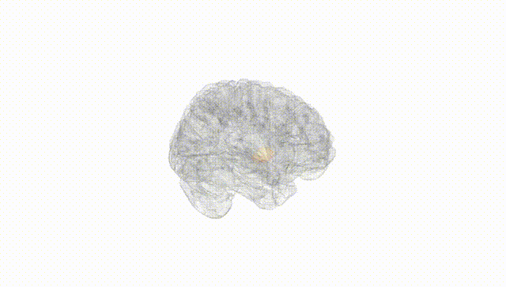
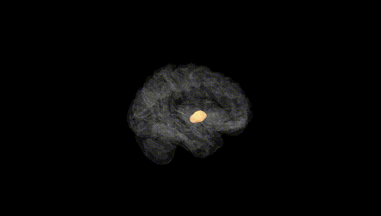
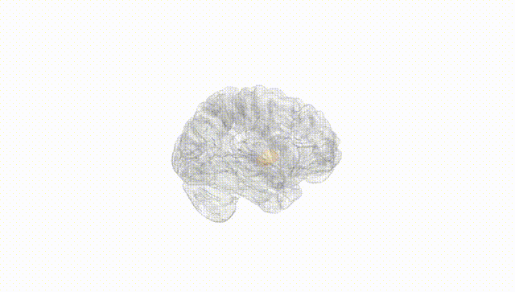
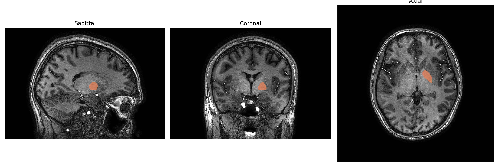
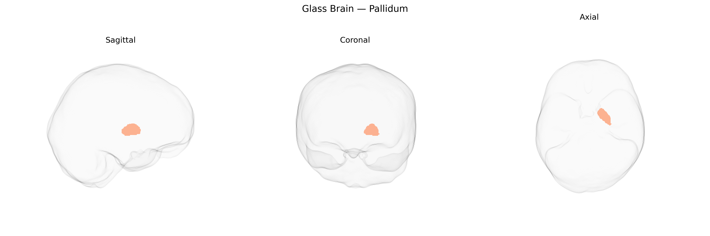

# Pallidum

## Overview

The left pallidum, part of the basal ganglia within the telencephalon, corresponds primarily to the left globus pallidus, which is subdivided into internal (GPi) and external (GPe) segments. It is composed largely of GABAergic projection neurons that modulate thalamocortical and brainstem motor pathways, playing a critical role in the regulation of voluntary movement, motor planning, and muscle tone, as well as contributing to cognitive and limbic processing through frontostriatal circuits. The left pallidum receives input predominantly from the ipsilateral striatum and projects to motor-related nuclei of the thalamus and brainstem, functioning as a key output node of the basal ganglia. Pathophysiological changes in the pallidum are implicated in movement disorders such as Parkinson’s disease, dystonia, and chorea. There is no direct Wikipedia page specifically for “Left Pallidum” as a separate structure; a closely related and encompassing article is: https://en.wikipedia.org/wiki/Globus_pallidus

*Overview generated by GPT-4o (2026).*

---

**Region ID:** 12  
**Hemisphere:** Left  
**Atlas:** brainCOLOR 

---

## Pallidum – Black Background (Full Brain)

**Full Quality Version:** [Download MP4](full_black.mp4)

---

## Pallidum – White Background (Full Brain)

**Full Quality Version:** [Download MP4](full_white.mp4)

---

## Pallidum – Black Background (Hemisphere)

**Full Quality Version:** [Download MP4](hemi_black.mp4)

---

## Pallidum – White Background (Hemisphere)

**Full Quality Version:** [Download MP4](hemi_white.mp4)

---

## Triplanar View – T1 Background

---

## Triplanar View – Ghost Brain


