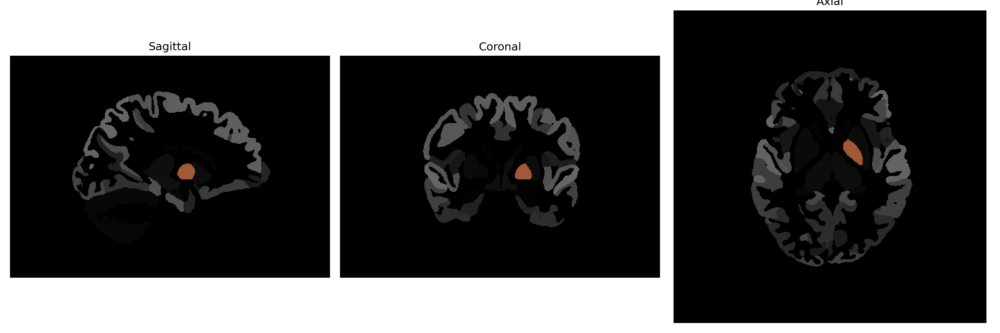

# Pallidum

## Overview

The left pallidum, a part of the basal ganglia, plays a critical role in the regulation of voluntary motor movements, procedural learning, and cognitive and emotional functions. Biologically, it is characterized by its high density of GABAergic neurons and is divided into two segments: the internal (medial) and external (lateral) segments, each having distinct connections and functions. The internal globus pallidus (GPi) serves as a major output nucleus of the basal ganglia, sending inhibitory signals to the thalamus and brainstem, while the external globus pallidus (GPe) is involved in modulating the activity of the subthalamic nucleus, part of the intricate circuitry that underlies motor control. This area is commonly associated with motor disorders such as Parkinson's disease, highlighting its importance in the basal ganglia-thalamocortical circuitry.

There is no direct Wikipedia link for the left pallidum's description in the context of the brainCOLOR Atlas, but a closely related page is available for the [Globus Pallidus](https://en.wikipedia.org/wiki/Globus_pallidus).

*Overview generated by GPT-4o (2026).*

---

**Region ID:** 12  
**Hemisphere:** Left  
**Atlas:** brainCOLOR 

---

## Full Brain – Black Background

**Full Quality Version:** [Download MP4](full_black.mp4)

---

## Full Brain – White Background

**Full Quality Version:** [Download MP4](full_white.mp4)

---

## Hemisphere Only – Black Background

**Full Quality Version:** [Download MP4](hemi_black.mp4)

---

## Hemisphere Only – White Background

**Full Quality Version:** [Download MP4](hemi_white.mp4)

---

## Triplanar View (Centered on ROI)

