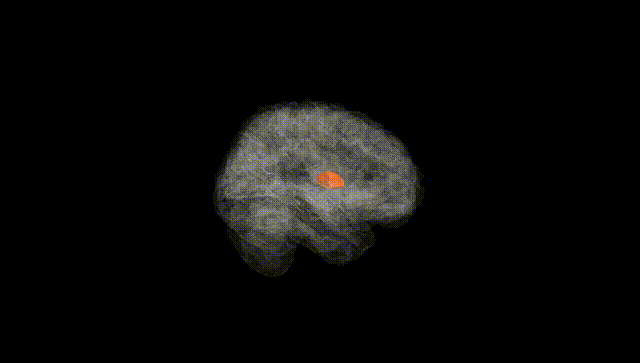
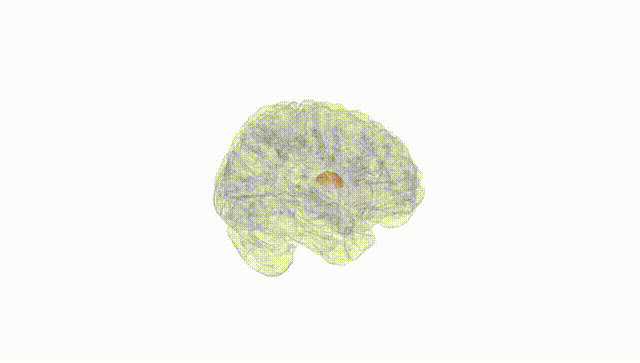
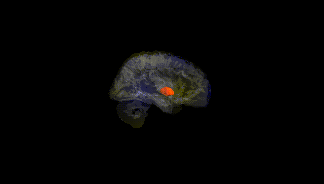
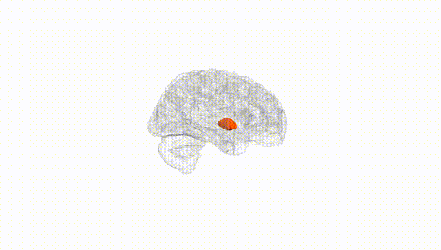
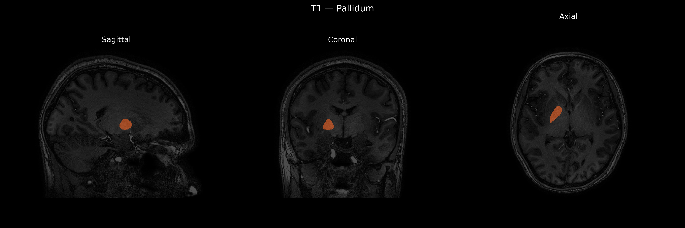
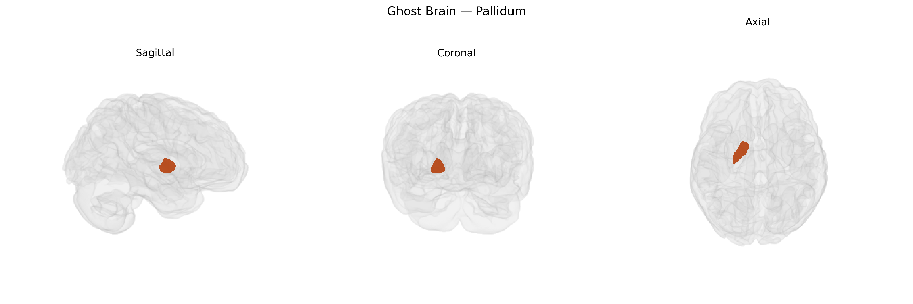

# Pallidum

## Overview

The right pallidum is the right-sided portion of the globus pallidus, a major component of the basal ganglia situated deep within the cerebral hemispheres, medial to the putamen and lateral to the internal capsule. It is divided into internal (medial) and external (lateral) segments, both composed largely of GABAergic projection neurons that exert inhibitory control over thalamocortical and brainstem motor pathways. Through its extensive connections with the striatum, subthalamic nucleus, and thalamus, the right pallidum participates in the regulation of voluntary movement, muscle tone, and aspects of motor learning and habit formation, with functional asymmetries sometimes reported between left and right hemispheric basal ganglia circuits. There is no direct Wikipedia link specifically for the “right pallidum” as a distinct entry; a closely related and encompassing structure is described here: https://en.wikipedia.org/wiki/Globus_pallidus

*Overview generated by GPT-4o (2026).*

---

**Region ID:** 11  
**Hemisphere:** Right  
**Atlas:** brainCOLOR 

---

## Full Brain – Black Background

**Full Quality Version:** [Download MP4](full_black.mp4)

---

## Full Brain – White Background

**Full Quality Version:** [Download MP4](full_white.mp4)

---

## Hemisphere Only – Black Background

**Full Quality Version:** [Download MP4](hemi_black.mp4)

---

## Hemisphere Only – White Background

**Full Quality Version:** [Download MP4](hemi_white.mp4)

---

## Triplanar View – T1 Background

---

## Triplanar View – Ghost Brain


