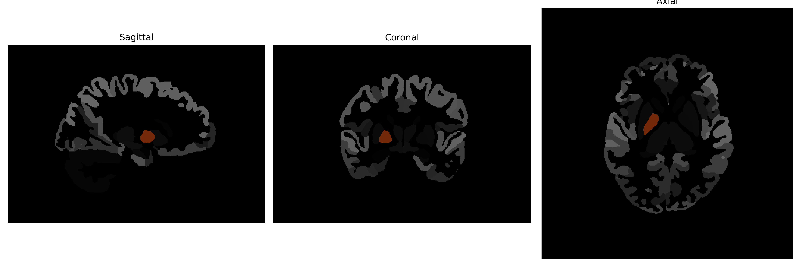

# Pallidum

## Overview

The right pallidum, part of the basal ganglia, plays a crucial role in the regulation of voluntary motor movements and procedural learning. It is located lateral to the internal capsule and medial to the putamen, comprising the external (GPe) and internal (GPi) segments. The pallidum receives input from the striatum and sends inhibitory signals to the thalamus, influencing motor cortex activity. It is involved in the modulation of movement by affecting the thalamic nuclei that project to the motor cortical areas. Dysfunctions in the pallidum are associated with neurological disorders like Parkinson's disease and Huntington's disease, where there is notable impairment in motor control and coordination.

There is no direct Wikipedia link to this specific description from the brainCOLOR Atlas. However, for a related structure, see the Wikipedia page on the globus pallidus: [Globus Pallidus](https://en.wikipedia.org/wiki/Globus_pallidus).

*Overview generated by GPT-4o (2026).*

---

**Region ID:** 11  
**Hemisphere:** Right  
**Atlas:** brainCOLOR 

---

## Full Brain – Black Background

**Full Quality Version:** [Download MP4](full_black.mp4)

---

## Full Brain – White Background

**Full Quality Version:** [Download MP4](full_white.mp4)

---

## Hemisphere Only – Black Background

**Full Quality Version:** [Download MP4](hemi_black.mp4)

---

## Hemisphere Only – White Background

**Full Quality Version:** [Download MP4](hemi_white.mp4)

---

## Triplanar View (Centered on ROI)

