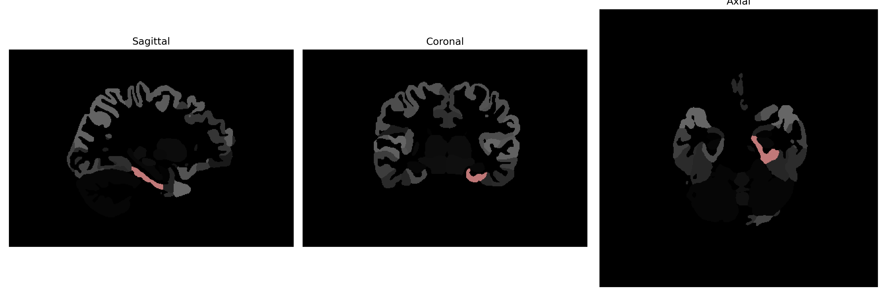

# parahippocampal-gyrus

## Overview

The left parahippocampal gyrus is a region of the brain located in the medial temporal lobe, adjacent to the hippocampus. It plays a crucial role in encoding and retrieving memory and is involved in processes related to spatial memory and navigation. Anatomically, the parahippocampal gyrus is situated beneath the hippocampal formation and is bordered by the collateral sulcus. The gyrus is part of the limbic system, which is integral to emotional and memory processing. It consists of several areas, including the entorhinal cortex, an important gateway for neural signals entering and leaving the hippocampus. The parahippocampal gyrus is also associated with the perception of scenes and visual contexts, contributing significantly to how individuals recognize and interpret complex visual stimuli and environmental cues.

There is no direct Wikipedia link to the parahippocampal gyrus according to the brainCOLOR Atlas, but more information can be found on the parahippocampal gyrus itself at [https://en.wikipedia.org/wiki/Parahippocampal_gyrus](https://en.wikipedia.org/wiki/Parahippocampal_gyrus).

*Overview generated by GPT-4o (2026).*

---

**Region ID:** 87  
**Hemisphere:** Left  
**Atlas:** brainCOLOR 

---

## Full Brain – Black Background

**Full Quality Version:** [Download MP4](full_black.mp4)

---

## Full Brain – White Background

**Full Quality Version:** [Download MP4](full_white.mp4)

---

## Hemisphere Only – Black Background

**Full Quality Version:** [Download MP4](hemi_black.mp4)

---

## Hemisphere Only – White Background

**Full Quality Version:** [Download MP4](hemi_white.mp4)

---

## Triplanar View (Centered on ROI)

